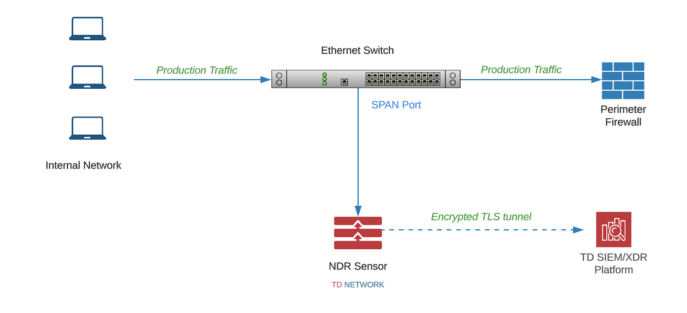

# Overview

## Overview

The CybrHawk Network Detection and Response (NDR) Sensor is available in two deployment options:

* [Physical Sensor](physical-sensor.md): High-performance hardware appliances designed for large enterprise or data-center environments.
* [Virtual Sensor](virtual-sensor.md): Software-based appliances suitable for smaller deployments and cloud-only environments.

Both types provide passive monitoring of network traffic to deliver visibility, intrusion detection, and behavioral analytics for the CybrHawk SecOps platform.

***

## Deployment

The NDR Sensor is a **passive device** that monitors a copy of production traffic.\
The recommended deployment location is where **North-South traffic** (internal ↔ external) passes through your environment, typically on the internal firewall interface.

To achieve this, configure a **SPAN (port mirroring)** session on your switch or firewall to forward traffic to the NDR sensor.

***

## Deployment Diagram

\
\&#xNAN;_Example span port configuration feeding mirrored traffic to a CybrHawk sensor._

***

## Example: Cisco Switch Port Mirroring

For a typical Cisco switch where the internal firewall is connected on port `eth0/1` and the CybrHawk sensor is connected on port `eth0/2`, the configuration would be:

```
monitor session 1 source interface eth0/1
monitor session 1 destination interface eth0/2
```

This configuration:

* Creates monitoring session **1**.
* Forwards traffic from the **source** interface (firewall port).
* Mirrors traffic to the **destination** interface (sensor port).

> **Note:** Interface notation (e.g., `eth0/1`) may vary depending on the switch model and configuration.

***

## Outbound Connectivity Requirements

For the NDR Sensor to operate correctly, outbound HTTPS access is required for updates and threat intelligence feeds.

* **Protocol / Port**: TCP/443 (HTTPS)
* **Purpose**: OS updates, CybrHawk Threat Intelligence feeds
* **Proxy Support**: Ensure proxy settings are configured to allow SSL/TLS inspection if required.
