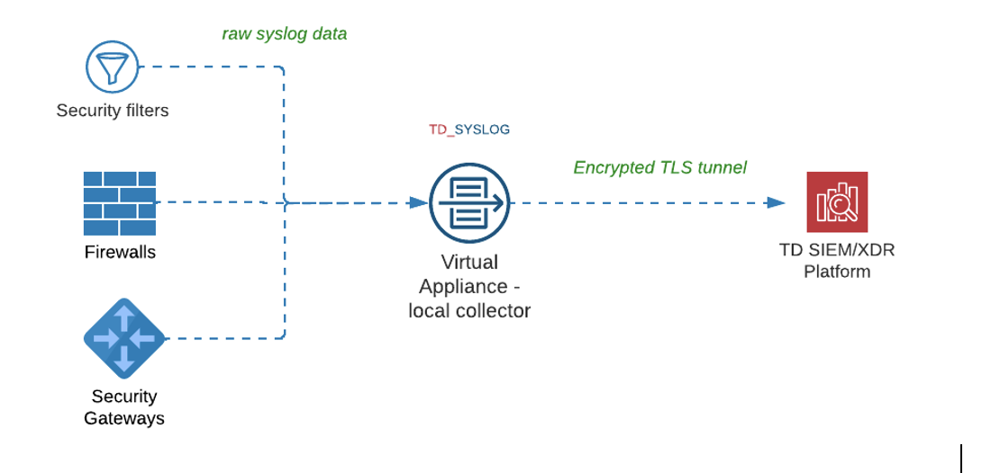

# Overview

CybrHawk provides deep detection and response capabilities to your endpoints, **24x7**.\
For log collection, a **virtual system collector** is fully configured and managed by CybrHawk.

The collector ensures **secure log delivery** over an **encrypted TLS channel** to the CybrHawk platform.

The diagram below demonstrates how the collector works:

***

### **CybrHawk-SYSLOG-VM**

The **CybrHawk-SYSLOG-VM** is a lightweight Linux virtual appliance that can be hosted on any hypervisor or bare-metal hardware.

* Supported platforms: VMware, Hyper-V, AWS, and other common hypervisors or cloud providers.
* CybrHawk experts can assist with sizing and configuration to match your environment.

***

### **Virtual Machine Resource Requirements**

Minimum VM resources required:

* **2 vCPUs**
* **8 GB RAM**
* **200 GB disk space**
* **Internet connectivity** (TCP 443, TCP 80, UDP 53)

***
