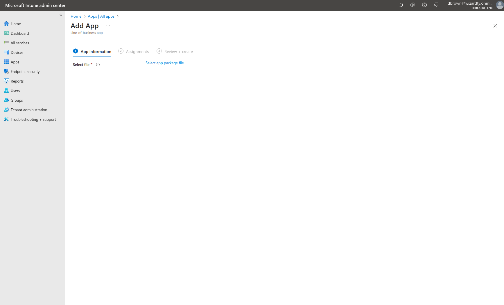
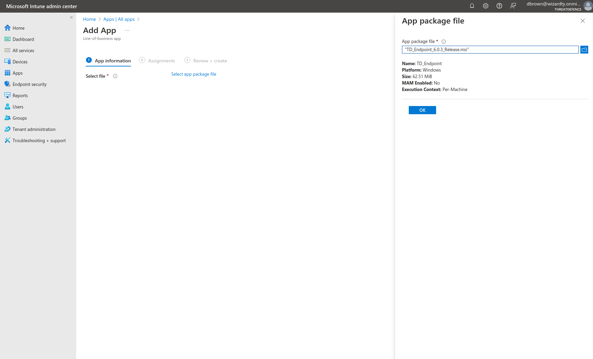
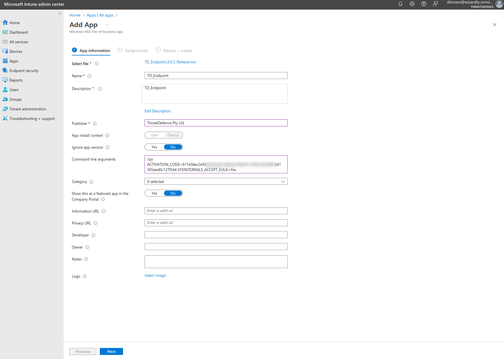
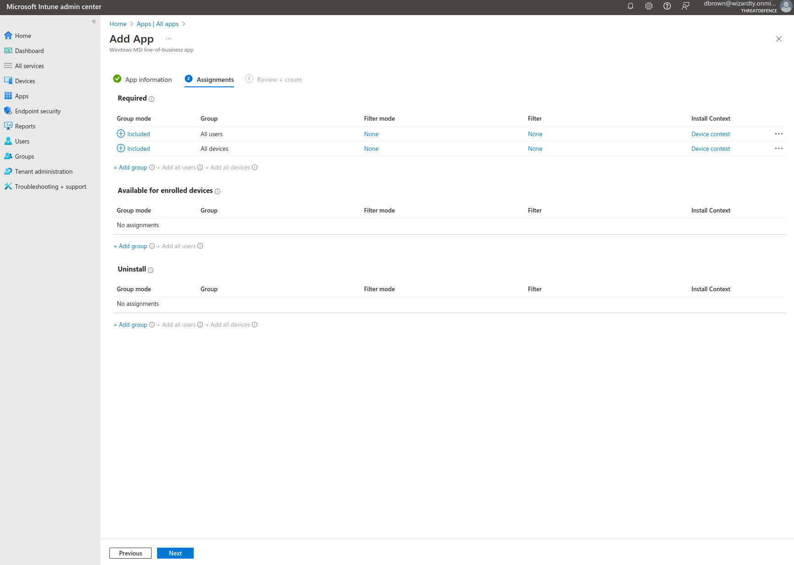
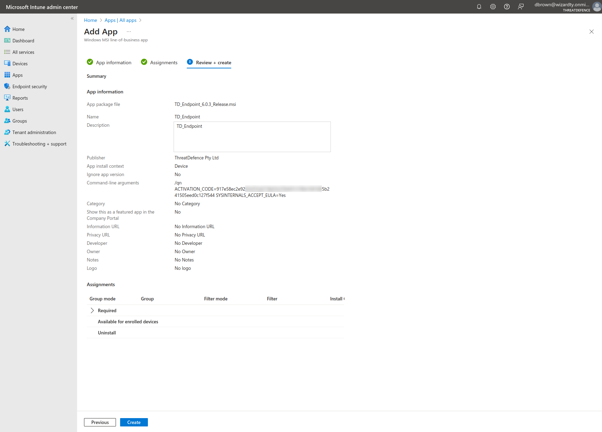
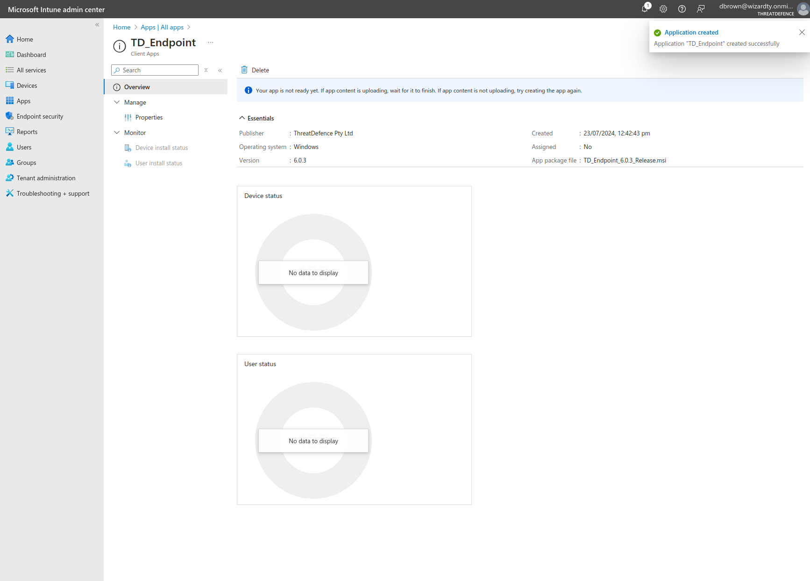
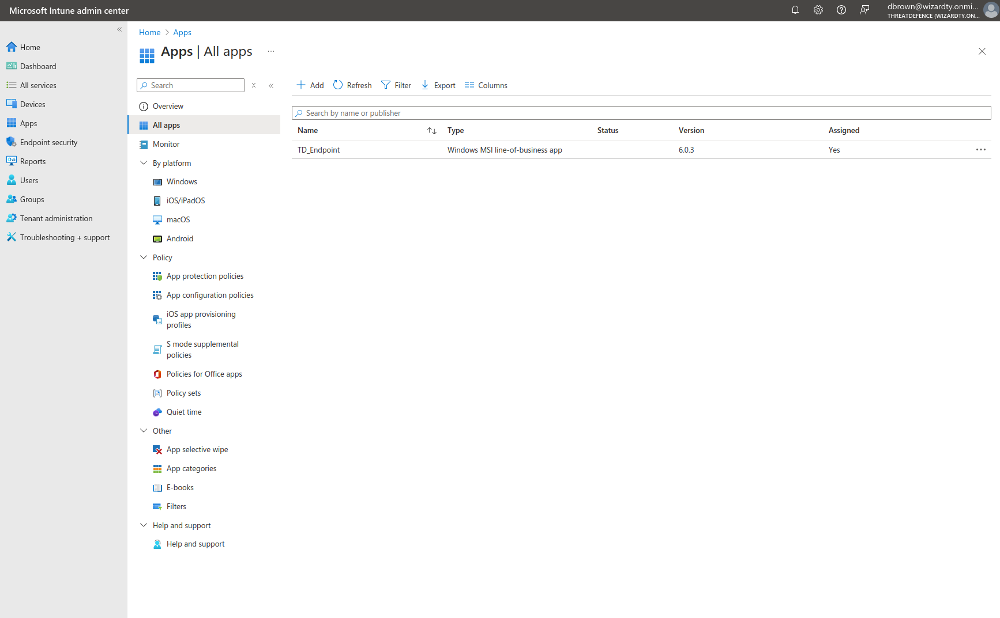

# Deploying via MS Intune

## Deployment via Microsoft Intune MDM

CybrHawk supports deployment of the Endpoint Agent via **Microsoft Intune**.\
This method is recommended for enterprise environments where agents need to be deployed and managed at scale.

For background information, refer to Microsoft’s official documentation on [Line-of-Business application deployment](https://learn.microsoft.com/en-us/mem/intune/apps/lob-apps-windows).

***

### Step-by-Step Guide

1.  **Open Intune Admin Center**

    * Navigate to the **Microsoft Intune admin center**.
    * From the left-hand navigation bar, select **Apps > All apps**.

    
2.  **Add a New Application**

    * Press **+ Add**.
    * Select **Line-of-business app**.

    
3.  **Select App Package File**

    * Upload the CybrHawk Endpoint Agent MSI file available in the [Customer Portal](https://portal.cybrhawk.com/deployment/endpoint-agent).

    \
    
4. **Configure App Information**
   * Set the **Publisher** field.
   * Populate the **Command-line arguments** as if calling `msiexec.exe` directly.\
     Example:

( `/qn ACTIVATION_CODE=... SYSINTERNALS_ACCEPT_EULA=Yes`).

5. Configure assignments or select **+ All users** and **+ All devices** to deploy globally.

6. Confirm the details, set a description, press **Create**.

7. After pressing create no further action is required.

8. Navigating back to Apps from the left navigation bar now shows an item for our deployment.

No further action is required, endpoints will automatically download and install the uploaded software.
