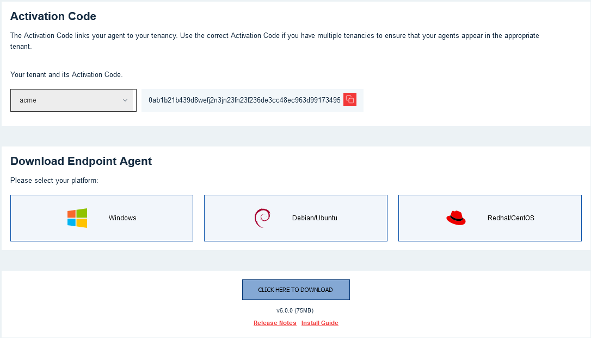
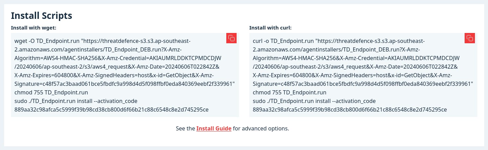
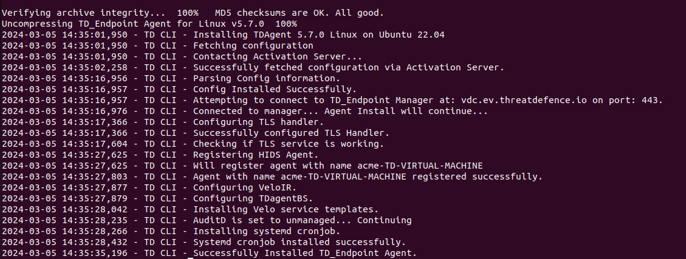
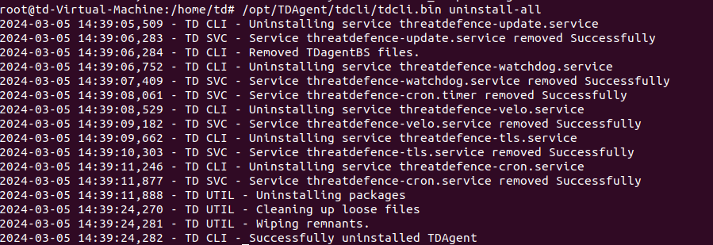

# Linux Agent

> **Note:**\
> Please check [Prerequisites and System Requirements](../prerequisites.md) before proceeding.

***

## Installation Steps

1. [Log in to the Customer Portal](https://portal.cybrhawk.com/deployment/endpoint-agent) and select your tenant from the dropdown menu.\
   Your **Activation Code** will be displayed.
2.  Choose your **Linux distribution**, then click **Generate Download Link**.

    
3.  Once the link is generated, either:

    * Click **Click Here to Download** to download the installer, or
    * Copy one of the **Install Scripts** from the panel that appears.

    
4. Transfer the downloaded installer to your Linux system (if downloaded), or run the commands from the **Install Scripts** panel.\
   For manual installation, run in your terminal:

```
chmod 755 TD_Endpoint.run
sudo ./TD_Endpoint.run install --activation_code ***your Activation Code***
```

5. The installer should complete, and provide output to your terminal.

### Advanced Options

#### Disable auto updates on installation:

```
chmod 755 TD_Endpoint.run
sudo ./TD_Endpoint.run install --activation_code ***your Activation Code*** --auto_update No
```

#### Use an explicit http proxy on installation:

```
chmod 755 TD_Endpoint.run
sudo https_proxy="http://PROXY_IP:PROXY_PORT" ./TD_Endpoint.run install --activation_code ***your Activation Code*** --proxy http://PROXY_IP:PROXY_PORT
```

#### Change auto update options after installation

**Enable:**

```
sudo /opt/TDAgent/tdcli/tdcli.bin enable-autoupgrade
```

#### Disable:

```
sudo /opt/TDAgent/tdcli/tdcli.bin disable-autoupgrade
```

### Uninstalling Linux Agent

Open your terminal and run the command: `sudo /opt/TDAgent/tdcli/tdcli.bin uninstall-all`



You should see the “Successfully uninstalled TDAgent” message as above.
