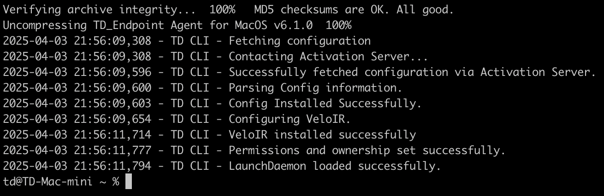
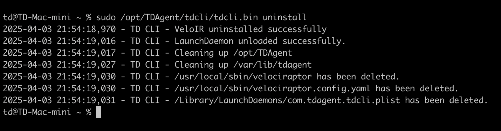

# Mac Agent

> **Note:**\
> Please check [Prerequisites and System Requirements](../prerequisites.md) before proceeding.

***

## Installation Steps

1. [Log in to the Customer Portal](https://portal.cybrhawk.com/deployment/endpoint-agent) and select your tenant from the dropdown menu.\
   Your **Activation Code** will be displayed.
2.  Choose **MacOS** from the available platforms, then click **Generate Download Link**.

    
3.  Once the link is generated, either:

    * Click **Click Here to Download** to download the installer, or
    * Copy one of the **Install Scripts** from the panel that appears.

    
4. Transfer the installer to your Mac (if downloaded), or run the script directly.\
   To install manually, open Terminal and run:

```
chmod +x ./TD_Endpoint_MacOS.run
sudo ./TD_Endpoint_MacOS.run install --activation_code ***your Activation Code***
```

5. The installer should complete, and provide output to your terminal.

### Uninstall

Open your terminal and run the command: `sudo /opt/TDAgent/tdcli/tdcli.bin uninstall`


