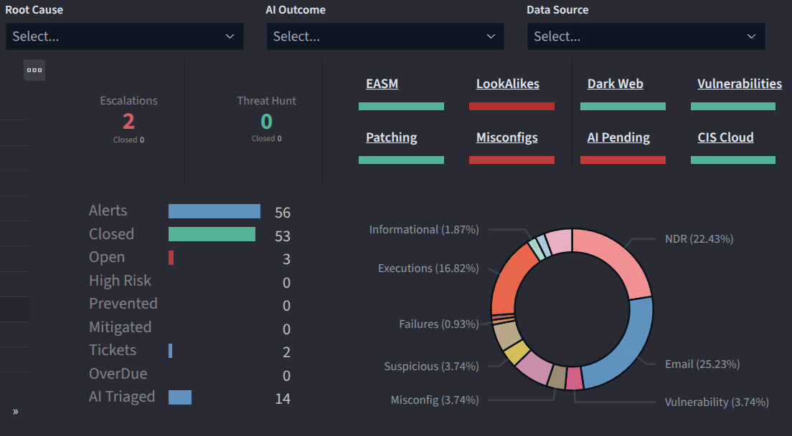

# NDR (Network Sensor)

## How can I see all NDR alerts?

Many options:

* On the main Security Detections dashboard, under Data Source drop down menu, choose Network Sensor or Network Intrusion;
*   OR click on the NDR section in the pie chart:

    <figure><figcaption></figcaption></figure>
* Under Main menu/My SOC/Alerts\&Detections/Network Behavior and Network Intrusion dashboards.

## How can I see all network traffic events (not alerts)

Under main menu/Network. Network traffic flows contains all traffic metadata for full assurance, so breaches will be recorded even if not detected and includes all business traffic. The other dashboards contain data for individual traffic types:

<figure><figcaption></figcaption></figure>

## How to inspect incoming traffic only?

In the top right corner, click on inbound to see all inbound traffic:

<figure><figcaption></figcaption></figure>

## How to see all anomalies and attacks?

Under main menu/Network/network Intrusion Detection, All network Intrusion Events. This module only records suspicious activity. To see all attacks from the outside, click on inbound under the Network Direction pie chart. To see what ports/services attract hackers, refer to the Destination Ports table that lists the count of unique incoming source IP's.
