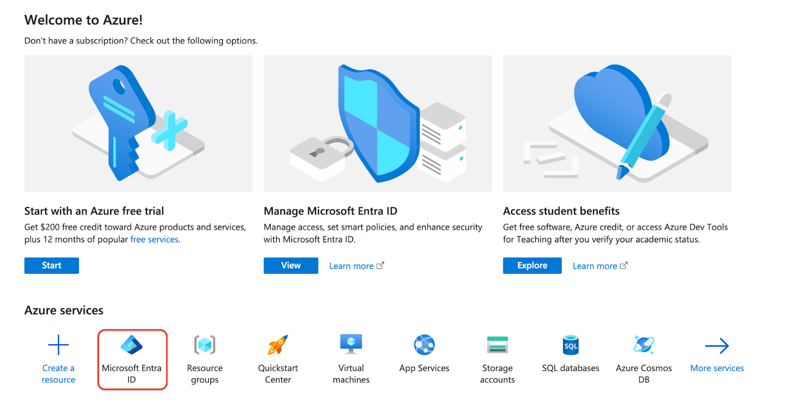
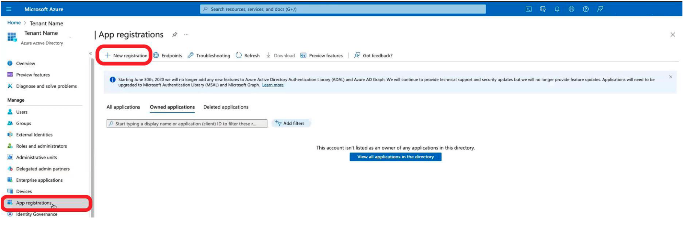
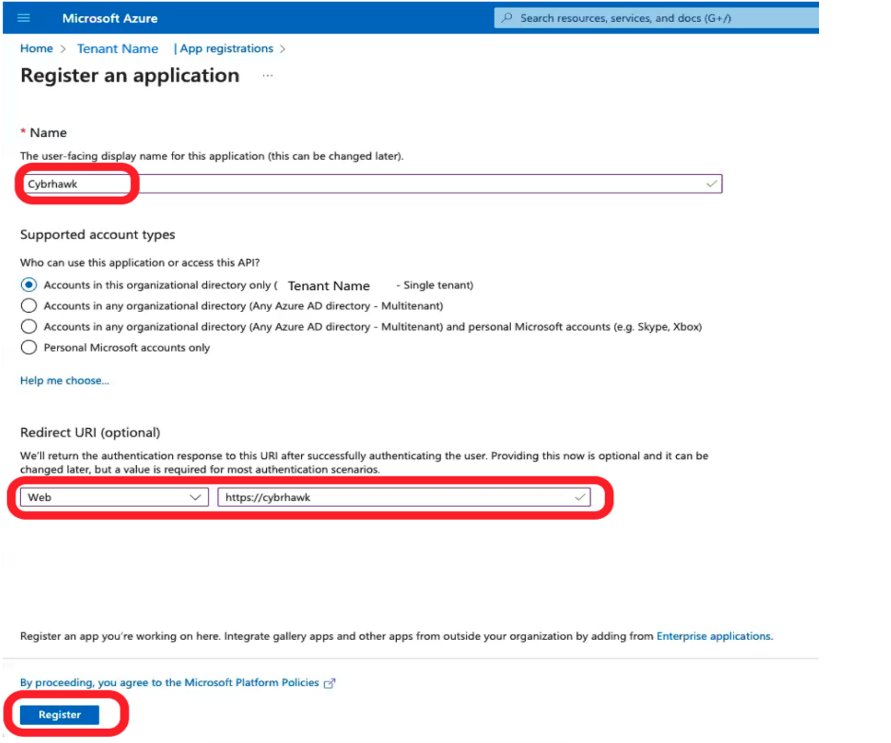
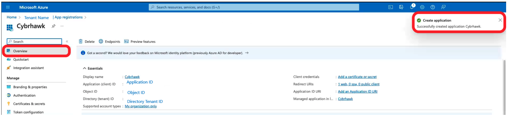
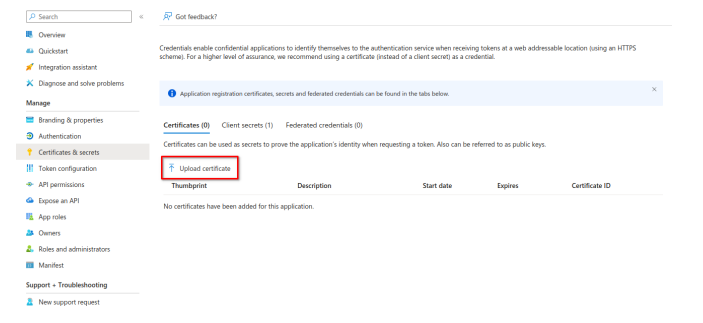
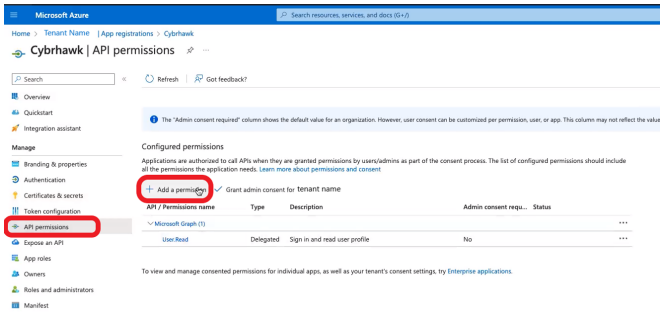
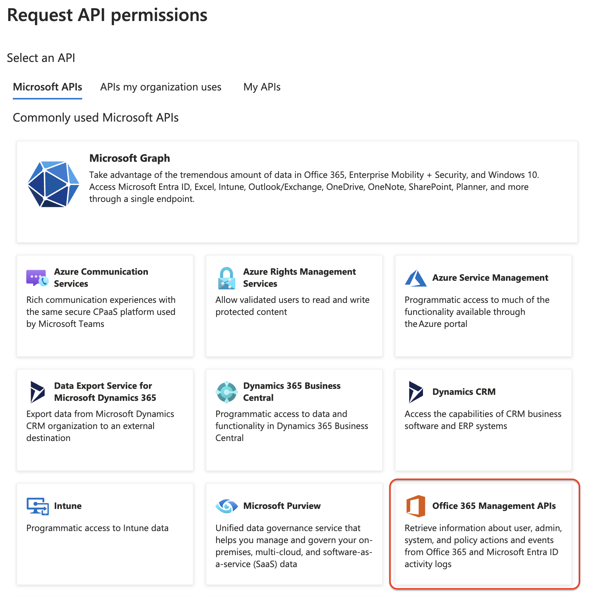
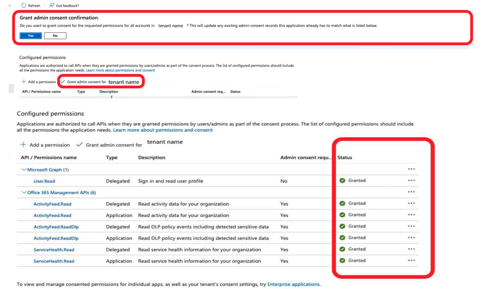

# Microsoft 365 Integration

This guide shows how to enable Microsoft 365 API access in CybrHawk SIEM.

> **Requirements:**
>
> * Access to Microsoft 365 services, including Microsoft 365 Compliance Center and Microsoft Entra ID
> * Any Microsoft 365 licensing tier

Click any screenshot to open the full-size image.

***

## Step 1: Enable auditing in Microsoft 365

Enable auditing before you continue. Follow Microsoft’s guide to [turn auditing on or off](https://learn.microsoft.com/en-us/purview/audit-log-enable-disable).

***

## Step 2: Register an application in Entra ID

1. Download CybrHawk’s Entra ID integration certificate from the SOC team.
2. Sign in to the [Entra ID portal](https://portal.azure.com).
3.  Open **Microsoft Entra ID**.

    [](../.gitbook/assets/entrawelcome.png)
4.  Select **App registrations** and click **New registration**.

    [](../.gitbook/assets/Screenshot_appregistration.png)
5.  Enter the required details, then click **Register**.

    [](../.gitbook/assets/Screenshot_appregistration2.png)
6.  Save the **Application (client) ID** and **Directory (tenant) ID** for later.

    [](../.gitbook/assets/Screenshot_appregistration3.png)
7.  Open **Certificates & secrets**.

    [](../.gitbook/assets/Screenshot_certificateandsecret.png)
8.  Click **Upload certificate**.

    [](../.gitbook/assets/Screenshot_certificateandsecret.png)
9. Upload the certificate from step 1, then click **Add**.

***

## Step 3: Grant API Permissions

1.  After creating the application, grant permissions to the Office 365 Management APIs.

    [](../.gitbook/assets/Screenshot_apipermissions.png)
2.  Open **API permissions** and select **Office 365 Management APIs**.

    [](../.gitbook/assets/apiperms.png)
3. Select **Application permissions** and enable the following:

```
ActivityFeed.Read
ActivityFeed.ReadDlp
```

4.  Click **Grant admin consent** and confirm.

    [](../.gitbook/assets/Screenshot_grantadminconsent.png)

***

## Step 4: Configure CybrHawk SIEM

1. Log in to the **CybrHawk SIEM Portal**.
2. Go to **Deployments** > **Integrations**.
3. Click **Add** and select **Microsoft 365**.

***

## Step 5: Add Microsoft Graph Integration

For advanced security auditing, Defender event ingestion, and user isolation features, complete the [MS365 Graph API](ms-graph.md).

***
