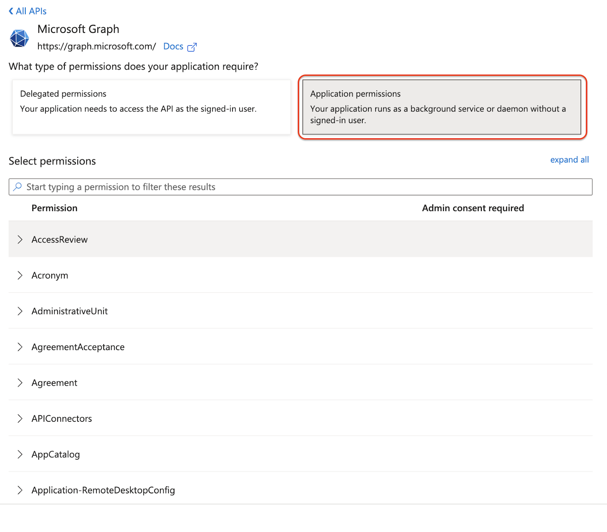

# MS365 Graph API

This guide walks you through enabling Microsoft Graph API access in CybrHawk SIEM, including onboarding the "User Isolator" functionality.

> **Requirements:**
>
> * Access to Microsoft 365 services (Microsoft 365 Compliance Center, Azure Active Directory)
> * **E5 or P1/P2 Licensing** (CybrHawk will automatically extract available security events based on your license).

***

## Step 1: Grant API Permissions in Azure Portal

### 1. Register an Application

* Create an Application ID and secret as described in the [Microsoft 365 Integration Guide](microsoft-365.md).


### 2. Assign Microsoft Graph API Permissions

* In your app registration, go to **API permissions**.
* Select **Microsoft Graph**.


### 3. Add Required Permissions

* Click **Application permissions**.
* Add the following permissions:

<table data-header-hidden><thead><tr><th width="342.05078125"></th><th width="279.73046875"></th><th></th></tr></thead><tbody><tr><td><strong>Permissions</strong></td><td><strong>Data</strong></td><td>Requirement</td></tr><tr><td>Application.Read.All</td><td>Application details and registrations</td><td>Required</td></tr><tr><td>ConsentRequest.Read.All</td><td>Allows the app to read consent requests and approvals without a signed-in user.</td><td>Required</td></tr><tr><td>Directory.Read.All</td><td>Read directory data (users, groups, apps)</td><td>Required</td></tr><tr><td>deviceAppManagement DeviceManagementConfiguration.Read.All DeviceManagementManagedDevices.Read.All</td><td>Access Intune device configuration, compliance policies, assignments, and the properties of Intune-managed devices.</td><td>Optional</td></tr><tr><td>SecurityAlert.Read.All</td><td>Access all security alerts without needing a signed-in user.</td><td>Required</td></tr><tr><td>SecurityIncident.Read.All</td><td>Access all security incidents without needing a signed-in user.</td><td>Required</td></tr><tr><td>IdentityRiskyUser.Read.All</td><td>Access your organisation's risky user data without a signed-in user.</td><td>Required</td></tr><tr><td>IdentityRiskyServicePrincipal.Read.All</td><td>Access your organisation's risky service principal information without a signed-in user.</td><td>Required</td></tr><tr><td>IdentityRiskEvent.Read.All</td><td>Access identity risk event information for the organisation.</td><td>Required</td></tr><tr><td>User.EnableDisableAccount.All User.RevokeSessions.All</td><td>Allows the app to revoke all sign-in sessions for a user and enable or disable user accounts, without requiring a signed-in user.</td><td>Optional</td></tr><tr><td>User.Read.All</td><td>Allows the app to read user profiles without a signed in user.</td><td>Required</td></tr><tr><td>Device.Read.All</td><td>Read your organisation’s device configuration information without a signed-in user.</td><td>Required</td></tr><tr><td>Reports.Read.All</td><td>Allows an app to read all service usage reports without a signed-in user. Services that provide usage reports include Office 365 and Azure Active Directory.</td><td>Required</td></tr><tr><td>SecurityEvents.Read.All</td><td>Allows the app to read your organization's security events without a signed-in user.</td><td>Required</td></tr><tr><td>AuditLog.Read.All</td><td>Allows the app to read and query your audit log activities, without a signed-in user.</td><td>Required</td></tr></tbody></table>

#### User Isolator Permissions

To enable User Isolation (Threat Containment by CybrHawk 24/7 SOC) features, also add:

```
User.EnableDisableAccount.All
User.RevokeSessions.All
```



### 4. Grant Admin Consent

* Click **Grant admin consent** and confirm.


***

## Step 2: Configure CybrHawk SIEM

1. Log in to your [CybrHawk SIEM Portal](https://portal.cybrhawk.com).
2. Navigate to **Deployments** > **Integrations**.
3. Click **Add** and select **Microsoft Graph**.

***

## Need Help?

If you have any questions or need further assistance, please contact [**CybrHawk Support**](mailto:support@threatdefence.com).

***
