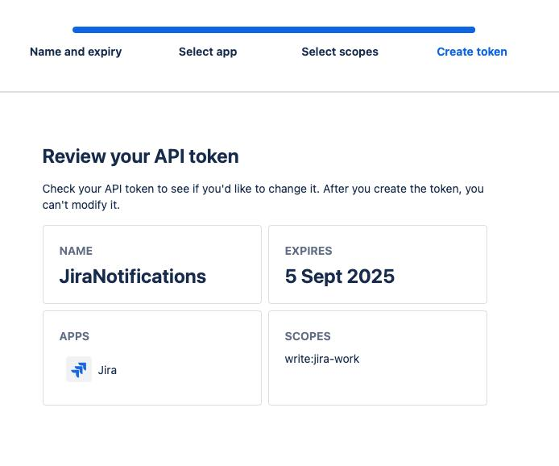
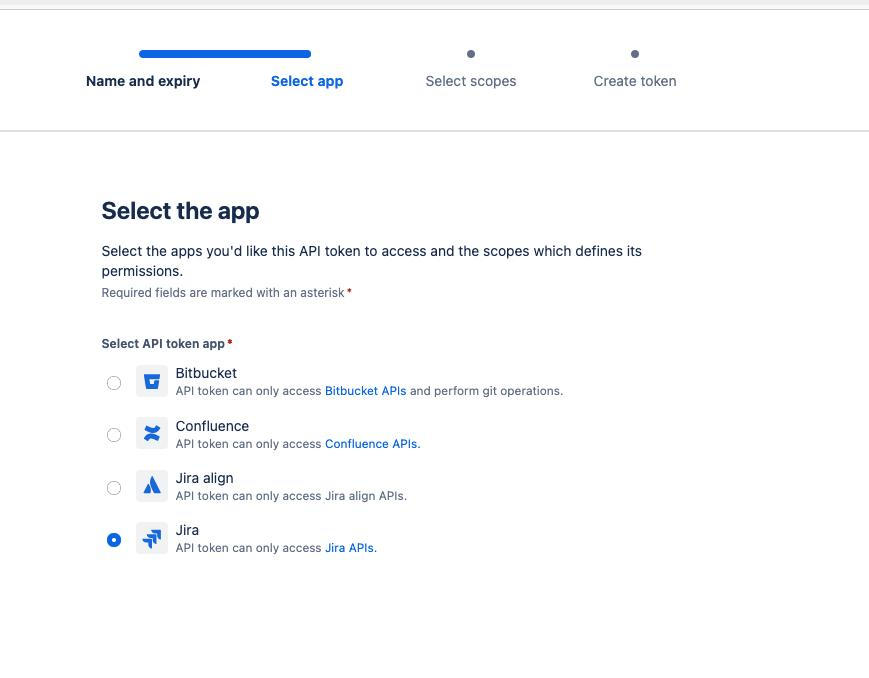
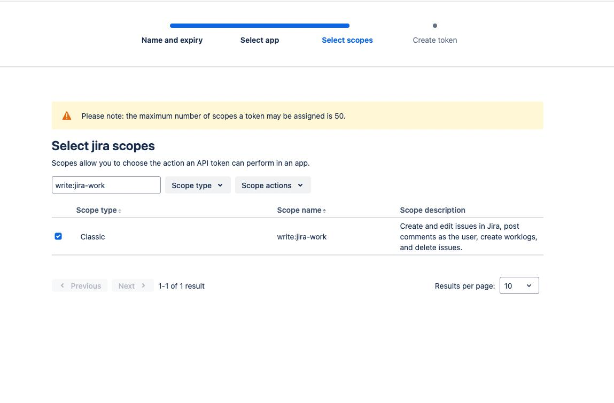

# Jira

## Step 1: Generate Credentials

1.  **Generate API Token**

    * Go to Atlassian API Token Management
      * Click _**Create Token**_
      * Label it (e.g., “Alert Integration”) and copy the token

    

    * Note down the _**admin email address**_ and _**Jira base URL**_ (e.g., https://your-domain.atlassian.net)
2.  **Assign Necessary Permission Scopes**

    * Go to _**Select App**_
      * Select _**Jira**_ app

    

    * Go to _**Select Scopes**_
      * Select _**write:jira-work**_

    

    * Review the settings

***

## Step 2: Define JIRA Issue Ticket Fields

1.  **Each alert will be converted into a Jira issue with the following fields**

    | Field        | Description                                                                      |
    | ------------ | -------------------------------------------------------------------------------- |
    | project      | Key or ID of the Jira project (e.g., "OPS", "ALERTS" or "10034", "2000")         |
    | issuetype    | Key or ID of type of issue (e.g., "Bug", "Task", "Incident" or "10040", "10000") |
    | reporter     | Atlassian account ID of the reporter (not email)                                 |
    | labels       | Optional: tags like "automated", "alert", "monitoring"                           |
    | customfields | Optional: map alert metadata to custom Jira fields                               |

    * Please use the following to gather more info about the custom fields, if necessary:
      * [Get custom field IDs for Jira](https://confluence.atlassian.com/jirakb/get-custom-field-ids-for-jira-and-jira-service-management-744522503.html)
      * Please note down the _**Custom Field Name**_ and the _**text value**_ that should be assigned to the custom field.

***

## Deliverables

Please email the following to socv2@cybrhawk.com:

1. **API Credentials**
   * Please make sure the following credentials are noted in the email.
     * JIRA\_EMAIL : admin email address
     * JIRA\_API\_TOKEN : generated API token
     * JIRA\_BASE\_URL : Jira base URL noted above
2. **Jira issue ticket fields**
   * Please note the fields needs to be set for the Jira issue ticket
     * project
     * issuetype
     * reporter
     * labels
     * customfields (names & values)
