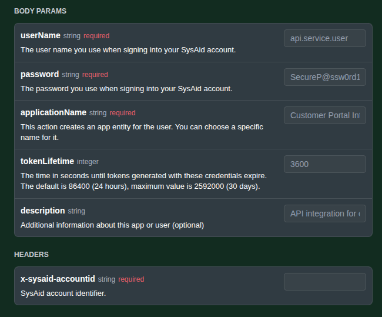
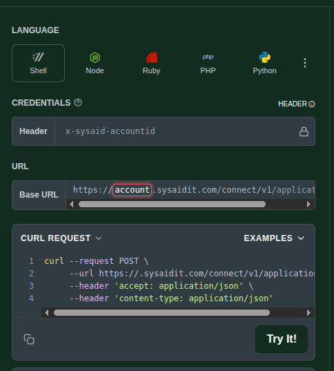
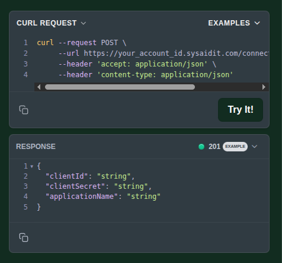

# SysAid

## Before you start

* You must use your SysAid account credentials and not SSO credentials to generate an access token. You can find them by going to your user profile in SysAid.
* Authentication is **limited to one SysAid account at a time** - the generated access token will only be able to access data from that specific account.

***

## Step 1: Create a SysAid Application Authentication

1. **SysAid Application**
   * A SysAid application is required for the alerter.
     * Please make sure you have a working SysAid application beforehand.
   * Please refer to [SysAid Getting Starter Guide](https://documentation.sysaid.com/docs/getting-started-guide) as needed.
2. **Create application key**
   * Navigate to the Developer Documentation for [SysAid public API](https://developers.sysaid.com/reference)
     * Navigate to [Create Application Key](https://developers.sysaid.com/reference/createapplicationkey) section.
     *   Fill in the _**userName**_ and _**password**_ for your _**SysAid Account Credentials**_ and _**applicationName**_ of the already created _**SysAid Application**_.

         
     * Fill in the _**tokenLifetime**_ as necessary, though default (24 Hrs) is sufficient.
     *   Make sure to fill the _**Header**_ and the _**URL**_ with the _**x-sysaid-accountid**_, which is your SysAid Account ID.

         
   *   Make sure to note down the response **clientId**, **clientSecret** and the **applicationName** for further use.

       

***

## Step 2: Gather Service Record Details

1. **Service Record Type - Incidents**
   * The service records of type _**Incidents**_ are created with each alert.
   * The default _**Incident**_ type Service Record _**Template**_ is used, if you need to change that, please note the _**templateId**_ need to be used.
   * Please note the following data related to the above _**templateId**_,
     * _**requestUser**_
     * _**assignedGroup**_
     * _**primaryCategory**_
     * _**secondaryCategory**_
     * _**secondaryCategory**_
     * _**thirdLevelCategory**_
2. **Alternative Method**
   * Alternatively, you can send an existing Incident type Service Record _**ID**_ to be used as the template.

***

## Deliverables

Please email to [support@threatdefence.com](mailto:support@threatdefence.com):

1. **Application Credentials**:
   * Please make sure the following credentials are noted in the email.
     * x-sysaid-accountid
     * applicationName
     * clientId
     * clientSecret
2. **Incident Service Record Details**:
   * Please make sure you include the details or a valid service record ID
   * If including the details,
     * requestUser
     * assignedGroup
     * templateId
     * primaryCategory
     * secondaryCategory
     * secondaryCategory
     * thirdLevelCategory
   * If including a valid Incident Service Record ID,
     * The ID of the service record.
