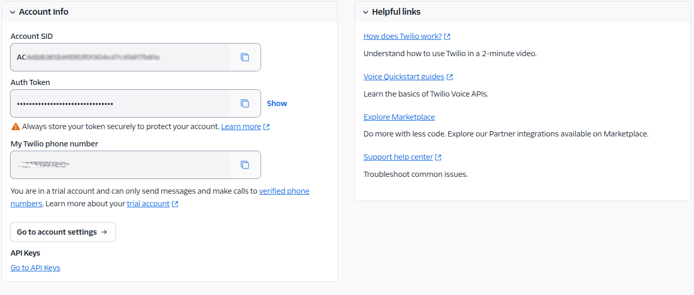

# Twilio

## Step 1: Twilio Account Setup & Credentials

1. **Create a Twilio Account**

* Visit [Twilio Sign Up](https://www.twilio.com/try-twilio) and register.
* Verify your email and log in to the Twilio Console.
  * Purchase a suitable plan and a **Twilio phone number**.

2. **Obtain API Credentials**

*   In the Twilio Console, find your **Account SID** and **Auth Token** under Account Info.

    
* Purchase a Twilio phone number for outbound calls.

***

## Step 2: Information Needed for Outbound Call Alerts

Provide the following details to enable automated outbound call alerts:

| **Field**    | **Description**                                         | **Example**                |
| ------------ | ------------------------------------------------------- | -------------------------- |
| Account SID  | Your Twilio Account SID                                 | `ACxx`                     |
| Auth Token   | Your Twilio Auth Token                                  | `xx`                       |
| Phone Number | Twilio phone number used for outbound calls             | `+1234567890`              |
| Recipients   | Comma-separated list of phone numbers to receive alerts | `+1987654321, +1098765432` |
| Message Text | Custom message to be delivered during the call          | `Alert: Action Required`   |

***

## Deliverables

Please email the to [support@threatdefence.com](mailto:support@threatdefence.com):

1. **Twilio Credentials**

* Account SID
* Auth Token
* Twilio Phone Number

2. **Alert Configuration**

* Recipients
* Message Text
* Enabled
* Time Window
* Severity

***
