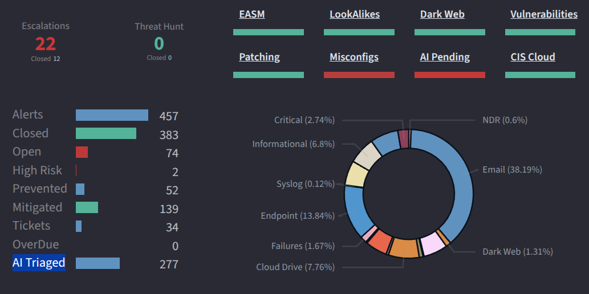

# AI Analyst

CybrHawk’s AI Analyst serves as your automated security operations specialist, working 24/7 to monitor, analyze, and respond to threats across your entire digital environment. By combining advanced machine learning with deep security expertise, it provides continuous protection, reduces operational workload, and enhances your team’s ability to detect and neutralize sophisticated attacks.

**Business Benefits:**

1. **Provides 24/7 security coverage** without human intervention, ensuring continuous threat monitoring and response regardless of time or staffing.
2. **Reduces operational costs** by automating routine analysis and response tasks, allowing your team to focus on strategic initiatives.
3. **Improves detection accuracy** through advanced behavioral analysis and correlation across multiple data sources, minimizing false positives.
4. **Accelerates incident response** by automatically executing pre-approved containment actions within seconds of threat detection.
5. **Enhances security consistency** by applying standardized analysis and response procedures across all alerts and incidents.

<figure><figcaption></figcaption></figure>

***

**How It Works: Automated Security Operations**

1. **Continuous Monitoring:** Analyzes incoming security data from all integrated sources (SIEM, EDR, network, cloud) in real-time.
2. **Intelligent Correlation:** Connects related events across systems and time to identify complex attack patterns that might escape manual detection.
3. **Automated Triage:** Evaluates and prioritizes alerts based on severity, context, and potential business impact.
4. **Instant Response:** Executes pre-approved playbooks for containment, notification, and remediation without human intervention.

***

**What It Delivers**

* Real-time threat detection and alerting
* Automated incident investigation and evidence collection
* Immediate containment actions for critical threats
* Detailed incident summaries with root cause analysis
* Continuous learning and adaptation to new threat patterns

***

**Use Cases**

* **24/7 Security Operations:** Maintain continuous protection outside business hours and during staffing gaps.
* **High-Volume Alert Processing:** Manage large alert volumes without additional human resources.
* **Rapid Threat Response:** Automatically contain threats like ransomware or compromised accounts within seconds.
* **Threat Hunting Support:** Identify subtle attack patterns through continuous analysis of historical and real-time data.
* **Compliance Reporting:** Generate detailed security reports and maintain audit trails automatically.

***

**Why It Matters**

Traditional security operations struggle with alert volume, staffing limitations, and the need for continuous coverage. CybrHawk's AI Analyst addresses these challenges by providing an always-available, consistently accurate security expert that never fatigues. This ensures that your organization maintains enterprise-grade security protection regardless of team size, time constraints, or evolving threat landscapes, ultimately providing stronger protection at lower operational cost.
