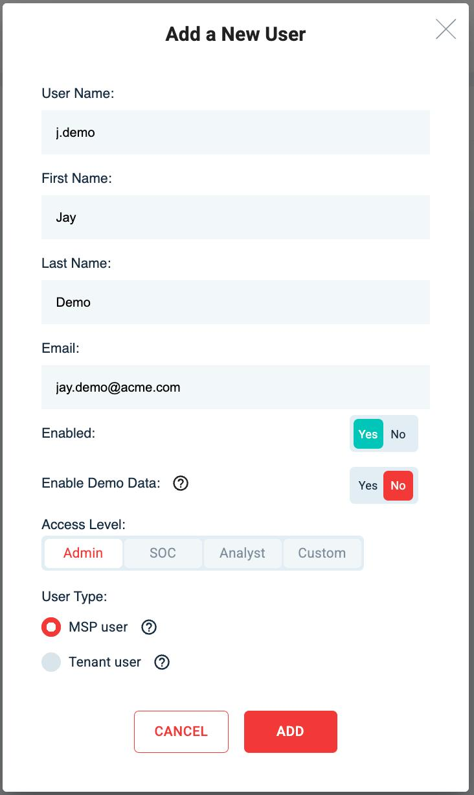

# User Management

## 1. Adding & Editing Users

To add or edit users, login to the customer portal and navigate to "My Tenants" then Click on "Users" as below:

<figure><figcaption></figcaption></figure>


Note: You will need be an Admin within your MSP or Tenant, or have the 'IAM Admin' permission assigned to you user, to be able to see and manage other users.


To add a new user, click the "ADD" button in the upper right-hand corner, as highlighted below:

<figure><figcaption></figcaption></figure>

After clicking "ADD" you'll be able to enter the required fields to create a user:

<figure><figcaption></figcaption></figure>

To edit a user, click on the edit icon circled in the image below:

<figure><figcaption></figcaption></figure>


See below for explanations on Demo Data, Admin & User Types.


***

## 2. User Roles & Permissions

#### Enabled

The "Enabled" toggle switch controls the state of the users account.

#### Demo Data

The "Enable Demo Data" toggle will allow users access to a demo tenancy called "acme" this contains sanitised data that can be visualised in our console dashboards.

#### Access Level

**Admin:**\
Admins have full access to the MSP/Tenancy (depending on the “User Type” described below)

**SOC:**\
SOC users have access focused on monitoring, incident response, and security-related functions within the environment.

**Analyst:**\
Analysts have access tailored to investigation, triage, and reviewing alerts or logs relevant to security operations.

**Custom:**\
If required for your use case, users can be given access to only specific areas by assigning the below permissions.

#### User Permissions

<table><thead><tr><th width="197.9453125"></th><th>Admin</th><th>SOC</th><th>Analyst</th></tr></thead><tbody><tr><td>App</td><td>Read Write Delete</td><td>Read Write Delete</td><td>Read Write Delete</td></tr><tr><td>
Alert Center

(Alert Listing / Triage / Esc)
</td><td><strong>✓ ✓ ✓</strong></td><td><strong>✓ ✓ ✓</strong></td><td><strong>✓ ✓ ✓</strong></td></tr><tr><td>Portal Report Summaries</td><td><strong>✓ ✓ ✓</strong></td><td><strong>✓ ✓ ✓</strong></td><td><strong>✓ ✓ ✓</strong></td></tr><tr><td>
ConfigDB

(Report Scheduling / Notifications)
</td><td><strong>✓ ✓ ✓</strong></td><td><strong>✓</strong></td><td><strong>✓</strong></td></tr><tr><td>Console / Data Access</td><td><strong>✓</strong></td><td><strong>✓</strong></td><td><strong>✓</strong></td></tr><tr><td>Integration Onboarding / Management</td><td><strong>✓ ✓ ✓</strong></td><td><strong>✓</strong></td><td><strong>✓</strong></td></tr><tr><td>User Isolation</td><td><strong>✓ ✓ ✓</strong></td><td><strong>✓ ✓ ✓</strong></td><td><strong>✓</strong></td></tr><tr><td>NDR</td><td><strong>✓ ✓ ✓</strong></td><td><strong>✓</strong></td><td><strong>✓</strong></td></tr><tr><td>IAM / User and Tenant Management</td><td><strong>✓ ✓ ✓</strong></td><td><strong>✓</strong></td><td><strong>✓</strong></td></tr><tr><td>Endpoint Isolation</td><td><strong>✓ ✓ ✓</strong></td><td><strong>✓ ✓ ✓</strong></td><td><strong>✓</strong></td></tr></tbody></table>

#### User Type

MSP User: An MSP User will have access to all tenants under the MSP, so if your MSP has 3 tenants, an MSP user will be able to access data from all 3 tenants based on their assigned permissions.

Tenant User: A tenant user will only be able to access and manage data for tenants that are explicitly defined against their user. So if an MSP has tenants, X, Y & Z and said user is only defined with access to tenant X, they will not be able to see or manage data from tenants Y & Z

## 3. Resetting Passwords & MFA

To reset a users password or MFA, click on the edit icon for their user and select the relevant option from the "Reset Options"

<figure><figcaption></figcaption></figure>

***

## Having Trouble?

If you're having any issues with user management, please open a request via the support portal, or email [**CybrHawk Support**](mailto:socv2@cybrhawk.com) and our team will assist you.
