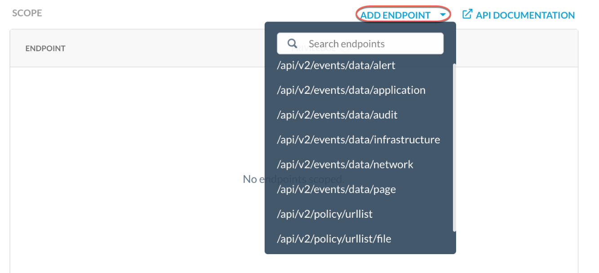
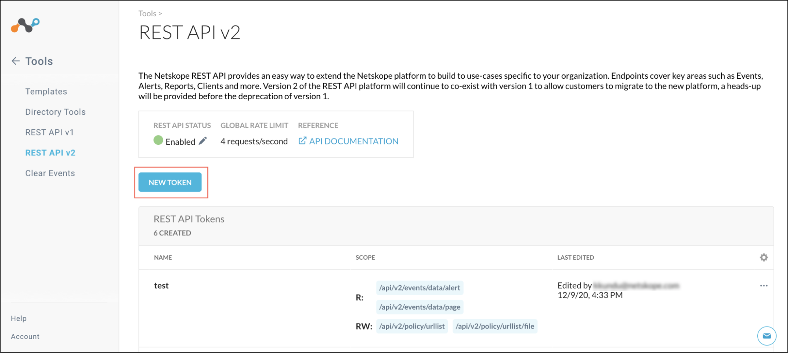
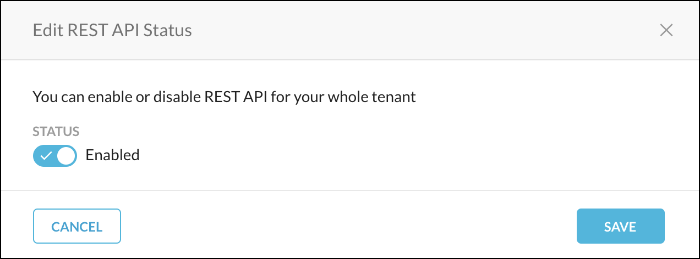
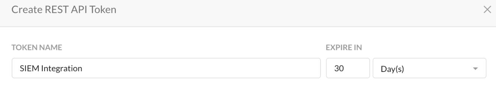
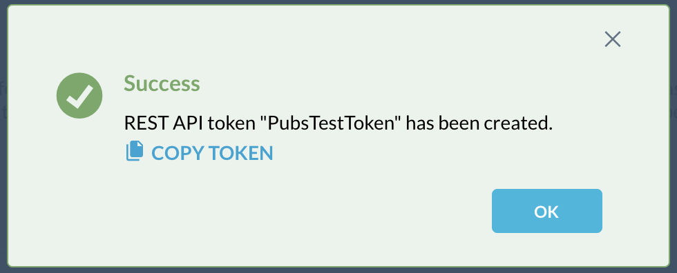

# Netskope

By integrating **Netskope** with **CybrHawk** via Netskope’s REST APIs and log streaming capabilities, you can ingest cloud activity, data loss prevention (DLP) alerts, and user behavior events directly into CybrHawk for centralized visibility and control.

This integration enables CybrHawk to monitor user interactions across SaaS, IaaS, and web applications—correlating cloud risk signals with broader security data to detect insider threats, enforce policies, and enhance incident response across your environment.

***

## Step 1. Obtain API Key

1. Log in to your **Admin Console** using your login URL.
   * Example: `https://<tenant-name>.au.goskope.com`
2.  Once logged in, ensure the **REST API** is enabled for your tenant.

    
3.  Navigate to the **REST API v2** page and select **New Token**.

    
4.  Enter your **token name** and **expiration date**.

    
5.  Select **Add Endpoint** and configure the events you want to collect.

    * Ensure that each endpoint is granted **read access**.

    
6.  When finished, click **Save** and **Copy Token**.

    * Store the token in a secure location.

    

***

## Step 2. Configure CybrHawk Integration

Provide the following information to your CybrHawk representative at [**CybrHawk Support**](mailto:socv2@cybrhawk.com):

* Netskope URL
* API Key

***

## Support

For questions or assistance, please contact: [**CybrHawk Support**](mailto:socv2@cybrhawk.com)
