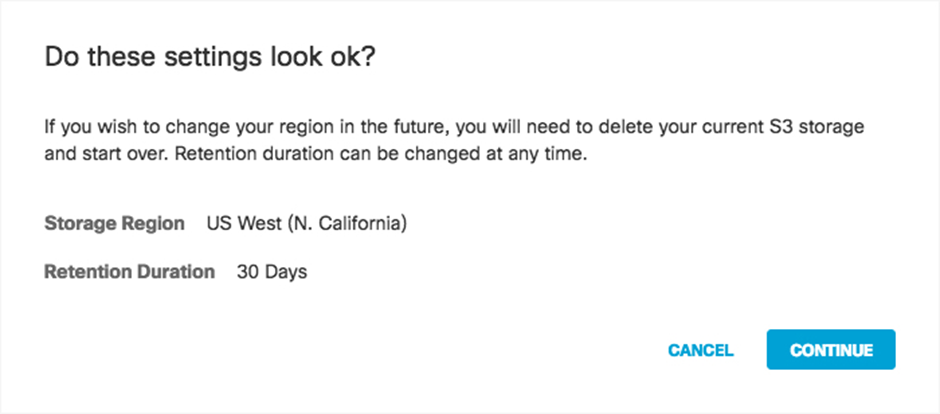
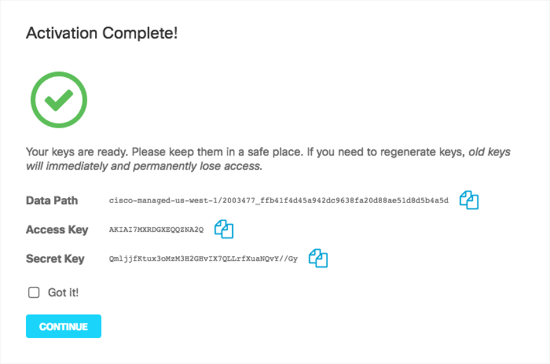
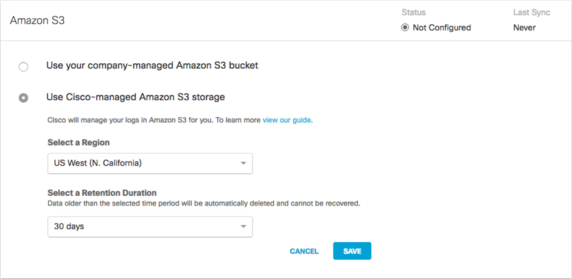
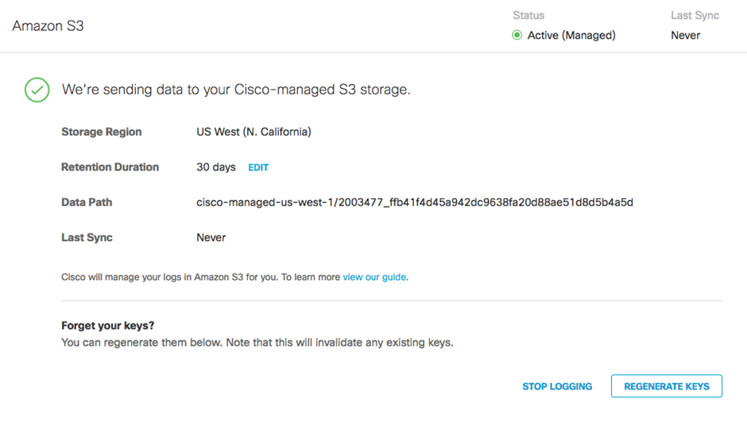

# Cisco Umbrella

Integrating **Cisco Umbrella** with CybrHawk allows you to ingest DNS-layer threat intelligence and security activity into CybrHawk in real time.

By leveraging Cisco Umbrella’s extensive threat data, you can:

* Improve visibility into malicious domain activity.
* Manage incident response more efficiently.
* Correlate network threats with other security data within CybrHawk.

***

## Step 1. Set up Region and Retention

1.  Navigate to **Admin → Log Management** and select **Use a Cisco-managed Amazon S3 Bucket**.

    
2.  Select a **Region** and **Retention Duration**.

    

**Region:**\
Regional endpoints help minimize latency when downloading logs. Not all Amazon S3 regions are supported. Choose the closest region to your location. To change the region later, you must delete your current settings and reconfigure.

**Retention Duration:**\
Choose **7, 14, or 30 days**. Data older than the selected period will be deleted and cannot be recovered. A shorter retention period is recommended if ingestion is frequent. This setting can be updated at any time.

3.  Click **Save**, then **Continue** to confirm your settings.

    
4.  Umbrella activates log export to AWS S3. After activation, the **Amazon S3 Summary** page appears:

    

***

## Step 2. Save Keys

1.  Copy the credentials from the **Amazon S3 Summary** page and store them securely.

    > **Important:** This is the only time the **Access Key** and **Secret Key** are shown.\
    > They are required to access your S3 bucket and download logs. If lost, you must regenerate them.
2. After copying the keys, check **Got it** and click **Continue**.

***

## Step 3. Configure CybrHawk Integration

Provide the following information to your CybrHawk representative at [**CybrHawk Support**](mailto:socv2@cybrhawk.com):

* S3 Bucket Name
* S3 Bucket Region
* S3 Bucket Data Path
* AWS Access Key
* AWS Secret Key

***

## Support

For questions or assistance, please contact: [**CybrHawk Support**](mailto:socv2@cybrhawk.com)
