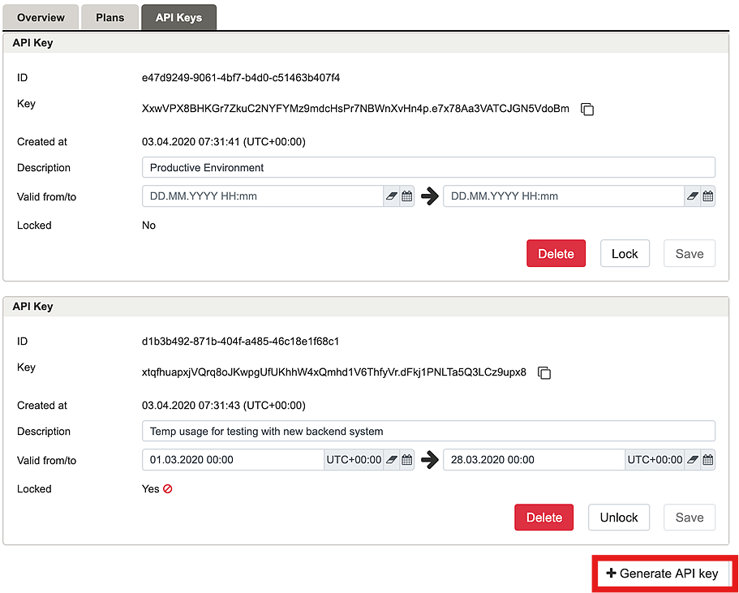

# Airlock

By integrating **Airlock Digital** with **CybrHawk** via Airlock’s logging and API capabilities, you can stream authentication, access control, and application firewall events directly into CybrHawk for unified visibility and proactive incident management.

This integration enables CybrHawk to monitor activity across Airlock’s secure access gateway and WAF layers—providing deep insight into user sessions, access policies, and web traffic behavior—while correlating with other security data to detect anomalies, enforce Zero Trust principles, and respond to threats in real time.

***

## Step 1. Generate API Key

1. Navigate to the **API Keys** tab.
2.  Click **Generate API Key** to create a new key.

    

***

## Step 2. Configure CybrHawk Integration

Provide the following information to your CybrHawk representative at\
📧 [**CybrHawk Support**](mailto:support@threatdefence.com):

* API Key
* API Base URL (host:port)

***
