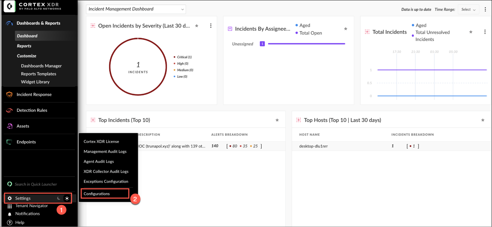
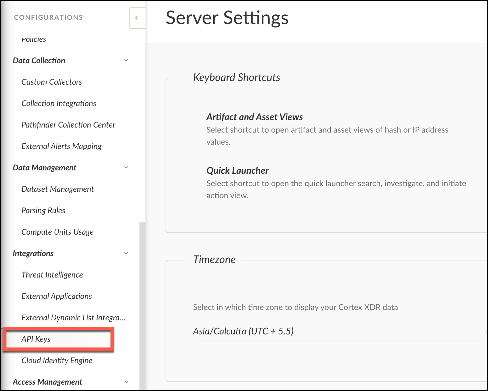
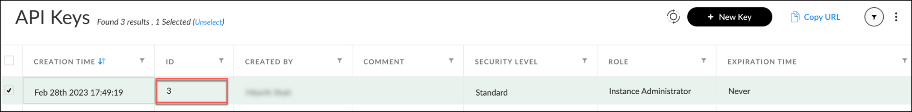
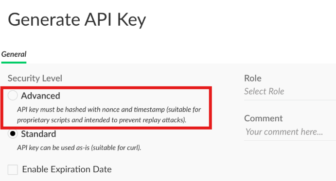
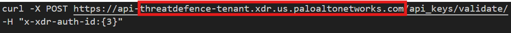
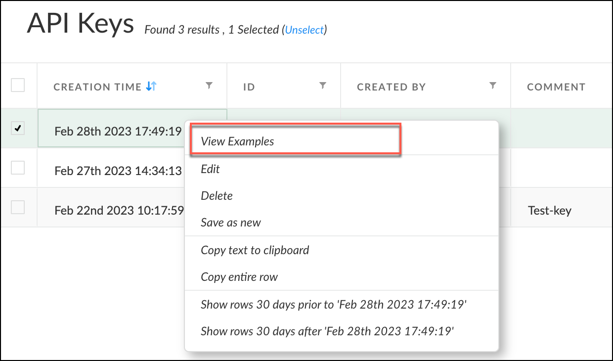
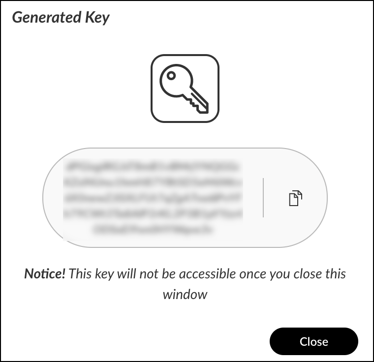

# Cortex XDR

By integrating **Cortex XDR** with **CybrHawk** via Cortex XDR’s APIs, you can seamlessly ingest alerts into CybrHawk and take advantage of Cortex XDR’s advanced alert stitching and investigation features.

This integration enables CybrHawk to manage incidents by reviewing and updating incident details, statuses, and assignees directly within your existing workflows. Additionally, CybrHawk can:

* Retrieve detailed endpoint information
* Trigger response actions on endpoints
* Deploy installation packages through Cortex XDR APIs .

This enhances automation, visibility, and response across your security environment.

***

## Prerequisites

Before proceeding, please ensure that Cortex XDR is properly configured and activated with the necessary permissions.\
If it hasn’t been set up yet, refer to the onboarding checklist here:\
[➡ Cortex XDR Onboarding Checklist](https://docs-cortex.paloaltonetworks.com/r/Cortex-XDR/Cortex-XDR-Cloud-Documentation/Cortex-XDR-onboarding-checklist)

***

## Step 1. Obtain Cortex XDR API Key

1. Access the **Cortex XDR Application Dashboard**.
2.  Navigate to **Settings → Configurations**.

    
3.  Go to **Integrations → API Keys**.

    
4. Select **+ New Keys**.
5.  Assign the **Advanced** security level.

    
6.  Copy the **API Key**.

    

***

## Step 2. Obtain Cortex XDR API ID

1. Navigate to the **API Keys** page.
2.  Copy the **API ID** value for the created API Key.

    

***

## Step 3. Obtain Cortex XDR FQDN

1.  On the **API Keys** page, right-click your created API Key and select **View Example**.

    
2. Review the CURL Example URL — it contains your unique **FQDN**, for example:

```
https://TENANT.xdr.us.paloaltonetworks.com/
```



***

## Step 4. Configure CybrHawk Integration

Provide the following information to CybrHawk:

* API Key
* API ID
* Cortex URL (FQDN)

***
