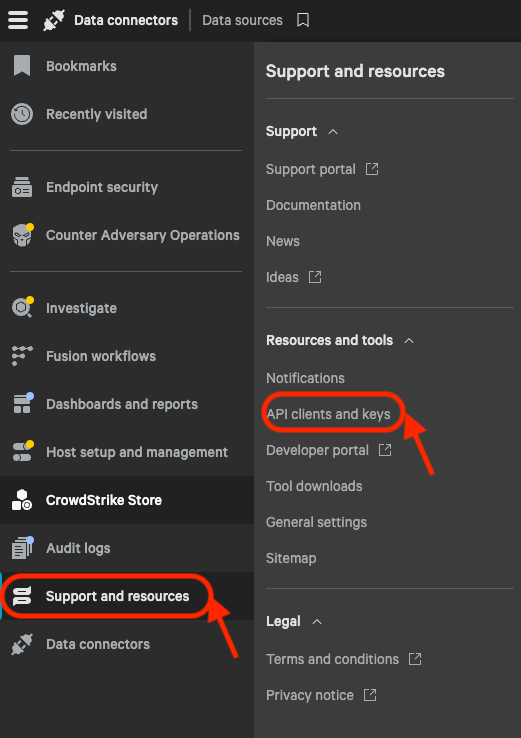
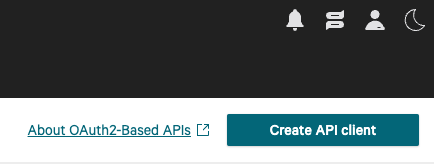
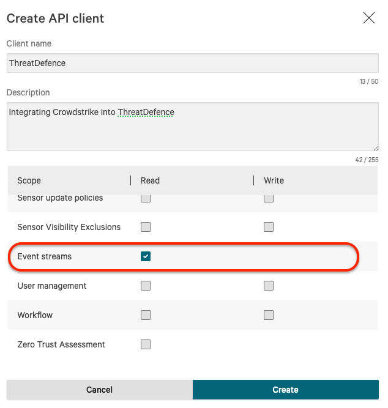
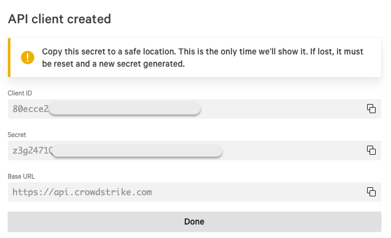

# CrowdStrike Falcon

## Step 1: Enable Auditing in CrowdStrike

To define a CrowdStrike API client and integrate it with CybrHawk, follow these steps:

1. **Access Crowdstrike Falcon UI**:
   * Log in to the CrowdStrike Falcon UI: https://falcon.crowdstrike.com with credentials that have been designated as the Falcon Administrator role.
2. **Navigate to API Clients and Keys**:
   * In the Falcon UI, navigate to Support and resources > API Clients and Keys. Here, you can view existing clients, add new API clients, or view the audit log.\
     
3. **Add a New API Client**:
   * Click on "Add new API Client" and provide a descriptive name for the client.\
     
   * Select the appropriate API scopes based on your integration requirements. Event streams is required.\
     
4. **Save Client Information**:
   * After saving the new API client, you will be presented with the Client ID and Client Secret.
   * The Client Secret will only be shown once and should be stored securely.
   * In case the Client Secret is lost, a reset must be performed, and any applications relying on it will need to be updated with the new credentials.\
     

## Step 2: Configuration in CybrHawk

**Provide CybrHawk with Client Information**:

* Provide the following information to your CybrHawk representative at [CybrHawk Support](mailto:socv2@cybrhawk.com):
  * Client ID.
  * Client Secret.
  * Base URL.
