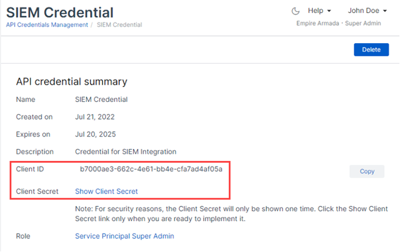

# Sophos Central

This guide provides steps to enable SophosCentral API access in your CybrHawk SIEM.

### Step 1: Configuration in SophosCentral Management Console

1. **Access Sophos Central Admin**:
   * Log in to Sophos Central Admin with administrative credentials.
2. **Navigate to API Credentials Management**:
   * Go to Global Settings > API Credentials Management page within Sophos Central Admin.
3. **Add New Credential**:
   * Click on "Add Credential" from the top-right corner of the screen.
   * Provide a Credential name and select the appropriate role.
   * Optionally, add a description for the credential.
   * Click "Add" to create the API credential. The API credential Summary will be displayed.
4. **Show Client Secret**:
   * Click on "Show Client Secret" to reveal the Client Secret associated with the created credential.
5. **Generate API Key**:
   * Go to your profile by clicking on your account email address (located in the upper-right corner) and selecting "My Profile."
   * Generate the API key from your profile settings.\
     

### Step 2: Configuration in CybrHawk

**Provide CybrHawk with Client Information**:

* Provide the following information to your CybrHawk representative at [CybrHawk Support](mailto:socv2@cybrhawk.com):
  * Client ID
  * Client Secret
