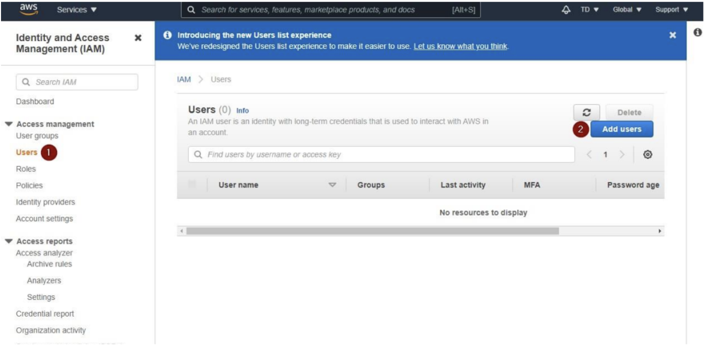
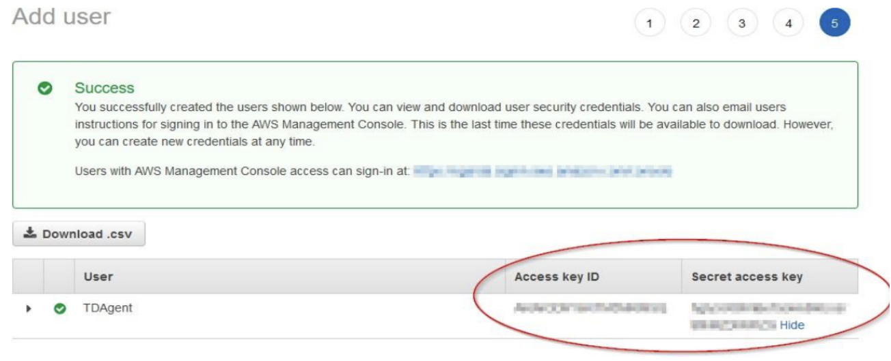
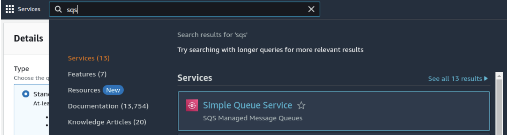
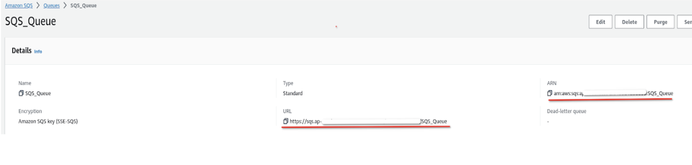
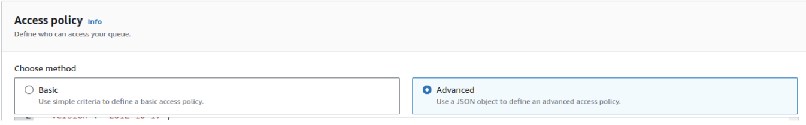
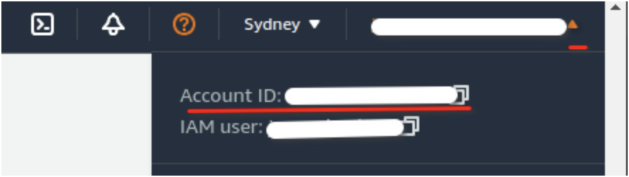
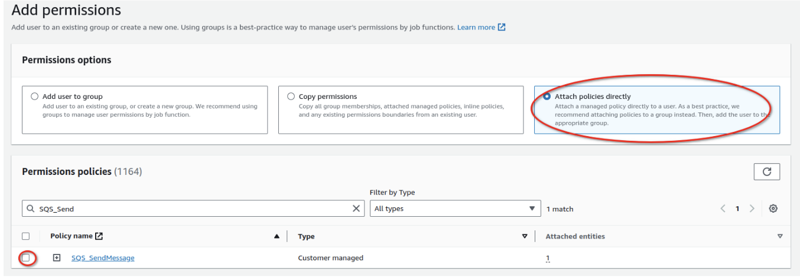
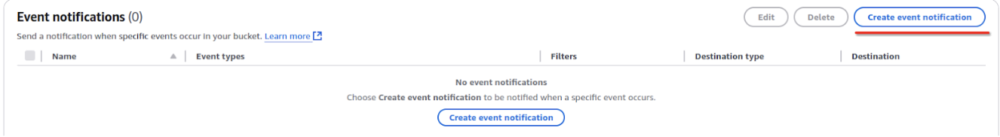
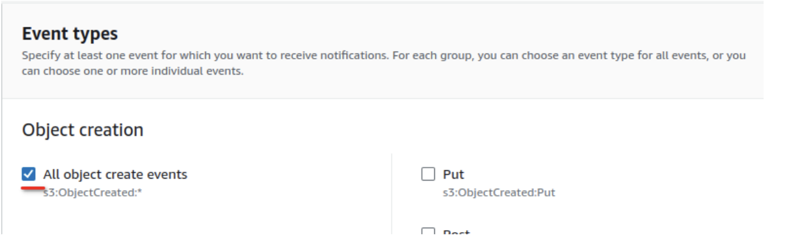
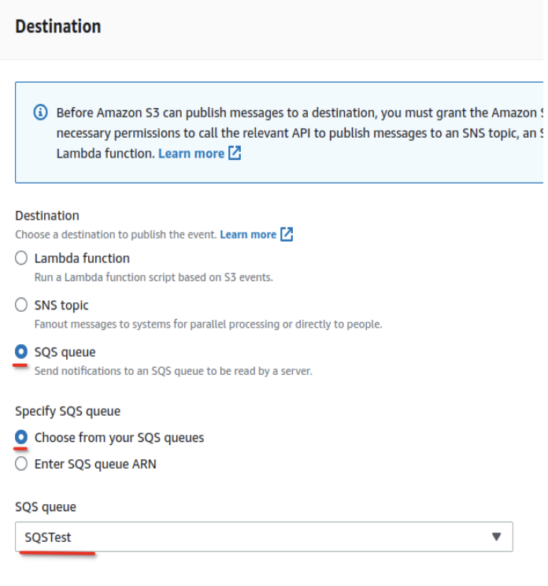

# AWS SQS

## Introduction

Many security tools generate event logs and store them in **Amazon S3** buckets for secure and scalable storage. To process and analyze these logs efficiently, integrating **Amazon Simple Queue Service (SQS)** with the S3 bucket is essential. SQS enables automated workflows by queuing and managing the log data retrieved from the S3 bucket.

This guide provides a step-by-step process for setting up an SQS queue to read data from an S3 bucket storing security logs.

## Prerequisites

* You already have an S3 bucket configured to receive security event logs.
* You have permissions to manage **IAM users**, **S3 bucket policies**, and **SQS queues**.

## Onboarding Steps

### Step 1: Create an IAM User

If you already have an existing IAM user (e.g., a TDAgent user) that was used for other AWS data sources, skip this step and proceed to Step 2. Otherwise, follow the steps below to create a new IAM user:

1. **Create a New User:**
   * Navigate to the **AWS Management Console**.
   * Go to **Services** > **Security**, **Identity**, **& Compliance** > **IAM**.
   * Under the **Access Management** section, click **Users**.
   * Click **Add Users**.
   * In the **User Details** screen:
     * Enter **TDAgent** as the username.
     * Check the box for **Access key - Programmatic access** to enable programmatic access for this user. Click **Next: Permissions** to proceed.



2. **Confirm User Creation and Obtain Credentials:**
   * Click **Next: Tags**, and then **Next: Review**.
   * Review the details and click **Create User** to finalize the creation.
   * Save the **Access Key ID** and **Secret Access Key** provided for the TDAgent user. These credentials are critical and must be securely shared with the **CybrHawk** team.



### Step 2: Create an SQS Queue

To create an SQS queue for processing logs from your S3 bucket, follow these steps:

1. **Navigate to SQS in AWS Console:**
   * Go to the **AWS Management Console**.
   * Select **Services** > **Simple Queue Service (SQS)**.



2. **Create a New Queue:**
   * Click **Create Queue**.
   * Choose the desired **queue type** (e.g., Standard or FIFO). For most use cases, a **Standard Queue** is sufficient.
   * Enter a name for the queue (e.g., SecurityLogsQueue).
   * Leave all other settings at their default values unless specific configurations are required for your environment.
3. **Save Queue Details:**
   * After the queue is created, locate and save the following details for future steps:
     * **Queue URL**: A unique identifier for your SQS queue.
     * **Queue ARN**: The Amazon Resource Name, used for permissions and integration with S3.



### Step 3: Update IAM Permissions

This step involves updating IAM permissions to ensure proper access to the S3 bucket and SQS queue. Follow the steps below to configure the access policy for your SQS queue and create two new IAM policies.

1.  **Update SQS Queue Access Policy**

    **Edit the Queue**

    * Navigate to **Services > SQS** and select the queue created in Step 2.
    * Click **Edit** and go to the **Access Policy** section.
    * Choose **Advanced** to enable manual policy editing.

    

    **Get Your Account ID:**

    * Locate your **Account ID** from the top-right corner of the AWS Console.

    

    **Modify the Access Policy:**

    * Use the following template to configure the SQS queue access policy:

    ```json
       {
       "Version": "2012-10-17",
       "Statement": [
          {
             "Sid": "AllowSQS",
             "Effect": "Allow",
             "Principal": {
             "Service": "s3.amazonaws.com"
             },
             "Action": "SQS:SendMessage",
             "Resource": "arn:aws:sqs:<QUEUE NAME>",
             "Condition": {
             "StringEquals": {
                "aws:SourceAccount": "<ACCOUNT ID>"
             },
             "ArnLike": {
                "aws:SourceArn": "arn:aws:s3:::<BUCKET NAME>"
             }
             }
          }
       ]
       }
    ```

Replace \<REGION>, \<ACCOUNT\_ID>, \<QUEUE\_NAME>, and \<BUCKET\_NAME> with the appropriate values:

* \<REGION>: The region of your SQS queue and S3 bucket.
* \<ACCOUNT\_ID>: Your AWS account ID.
* \<QUEUE\_NAME>: The name of the SQS queue created earlier.
* \<BUCKET\_NAME>: The name of the S3 bucket storing your logs.

You can locate your \<BUCKET\_NAME> by navigating to **Services > S3** in the AWS Console. Select the bucket storing your log files, go to the **Properties** tab, and copy its **ARN** (Amazon Resource Name).

2.  **Create IAM Policies**

    1. **Navigate to IAM:**

    * Go to **Services > IAM**, and select **Policies** from the left-hand menu.

    1. **Create the First Policy (S3 Bucket Access):**

    * Click **Create Policy**, then select the **JSON** editor.
    *   Paste the following template and replace \<BUCKET\_NAME> with your S3 bucket's name:

        ```json
           {
           "Version": "2012-10-17",
           "Statement": [
              {
                 "Sid": "GetLogsFromBucket",
                 "Effect": "Allow",
                 "Action": [
                    "s3:GetObjectVersion",
                    "s3:GetObjectRetention",
                    "s3:GetObject"
                 ],
                 "Resource": [
                    "arn:aws:s3:::<BUCKET NAME>",
                    "arn:aws:s3:::<BUCKET NAME>/*"
                 ]
           }
           ]
           }
        ```

        Save the policy and name it (e.g., S3BucketAccessPolicy).

    1. **Create the Second Policy (SQS Queue Access):**

    * Click **Create Policy**, then select the **JSON** editor.
    *   Paste the following template and replace \<QUEUE\_NAME> and \<ACCOUNT\_ID> with the appropriate values. Ensure that \<QUEUE\_NAME> matches the name of the queue created in step 1.

        ```json
        {
           "Version": "2012-10-17",
           "Statement": [

           {
                    "Effect": "Allow",
                    "Action": [
                       "sqs:SendMessage",
                       "sqs:ReceiveMessage",
                       "sqs:DeleteMessage",
                       "sqs:GetQueueAttributes"
                    ],
                    "Resource": [
                       "Resource": "arn:aws:sqs:<QUEUE NAME>"
                    ]
              }
           ]
        }
        ```

    Save the policy and name it (e.g., SQSQueueAccessPolicy).
3. **Attach Policies to the TDAgent User**

**Navigate to IAM Users:**

* Go to **IAM > Users** and select the TDAgent user created in Step 1.

4. **Attach Policies:**

* Click **Add Permissions**, select **Attach Policies Directly**, and search for the two newly created policies (S3BucketAccessPolicy and SQSQueueAccessPolicy).
* Select both policies and attach them to the TDAgent user.



### Step 4: Create Event Notifications

1. **Navigate to S3:**

* Go to **Services > S3** in the AWS Console.
* Select the bucket where your log files are stored.

2. **Access Event Notifications:**

* In the bucket, go to the **Properties** tab.
* Scroll down to **Event Notifications** and click **Create Event Notification**.



3. **Configure the Event Notification:**

* **Name**: Enter a name for the event notification (e.g., LogCreateEvent).
* **Event Types**: Select **All object create events** to capture log creation events.



4. **Set the Destination:**

* Under **Destination**, select **SQS Queue**.
* Specify the SQS queue created in Step 2 by entering its ARN.



5. **Save the Configuration:**

* Review the event notification settings and save your changes.

6. **Provide Queue URL to Support Team:**

* Copy the **Queue URL** of the SQS queue.
* Share the URL with the **CybrHawk Support Team** to complete the integration.
