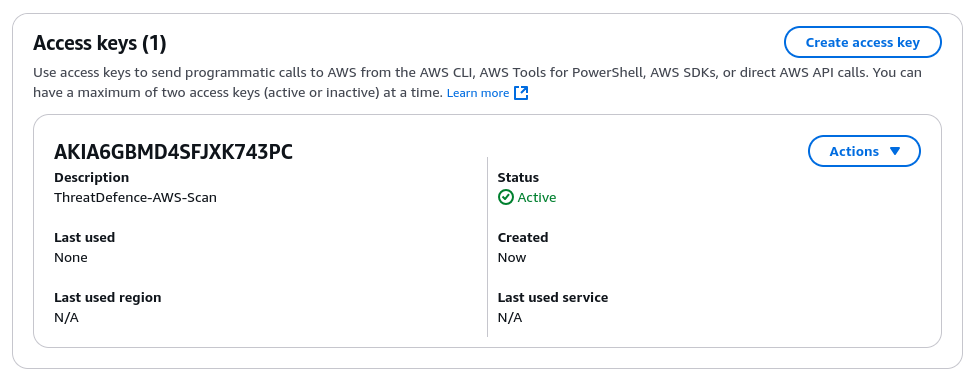

# Amazon Web Services (AWS)

CybrHawk's AWS integration provides best practice assessments, audits, incident response, continuous monitoring, hardening and forensics readiness, and also offers remediations.

## Requirements

CybrHawk requires an AWS Access Key ID, and the associated AWS Secret Access Key. Please find relevant AWS documentation at https://docs.aws.amazon.com/IAM/latest/UserGuide/id\_credentials\_access-keys.html.

## Step 1. Create an AWS User with Required Permissions

To get started, create an AWS user with IAM role attached holding the following policy:

```json
{
  "Version": "2012-10-17",
  "Statement": [
    {
      "Action": [
        "account:Get*",
        "appstream:Describe*",
        "appstream:List*",
        "backup:List*",
        "bedrock:List*",
        "bedrock:Get*",
        "cloudtrail:GetInsightSelectors",
        "codeartifact:List*",
        "codebuild:BatchGet*",
        "codebuild:ListReportGroups",
        "cognito-idp:GetUserPoolMfaConfig",
        "dlm:Get*",
        "drs:Describe*",
        "ds:Get*",
        "ds:Describe*",
        "ds:List*",
        "dynamodb:GetResourcePolicy",
        "ec2:GetEbsEncryptionByDefault",
        "ec2:GetSnapshotBlockPublicAccessState",
        "ec2:GetInstanceMetadataDefaults",
        "ecr:Describe*",
        "ecr:GetRegistryScanningConfiguration",
        "elasticfilesystem:DescribeBackupPolicy",
        "glue:GetConnections",
        "glue:GetSecurityConfiguration*",
        "glue:SearchTables",
        "lambda:GetFunction*",
        "logs:FilterLogEvents",
        "lightsail:GetRelationalDatabases",
        "macie2:GetMacieSession",
        "macie2:GetAutomatedDiscoveryConfiguration",
        "s3:GetAccountPublicAccessBlock",
        "shield:DescribeProtection",
        "shield:GetSubscriptionState",
        "securityhub:BatchImportFindings",
        "securityhub:GetFindings",
        "servicecatalog:Describe*",
        "servicecatalog:List*",
        "ssm:GetDocument",
        "ssm-incidents:List*",
        "support:Describe*",
        "tag:GetTagKeys",
        "wellarchitected:List*"
      ],
      "Resource": "*",
      "Effect": "Allow",
      "Sid": "AllowMoreReadForProwler"
    },
    {
      "Effect": "Allow",
      "Action": [
        "apigateway:GET"
      ],
      "Resource": [
        "arn:aws:apigateway:*::/restapis/*",
        "arn:aws:apigateway:*::/apis/*"
      ]
    }
  ]
}
```

## Step 2. Generate Access Keys

Then, generate an access token for a new user with these permissions assigned. Make sure to save the secret key, as it only appears once. These can then be sued to activate the integration.



## Step 3. Deploy the integration via the Portal

Navigate to Deployment > Integrations > click add. Further guidance is available in [Managing Integrations](../../platform-management/managing-integrations.md).

Required:

* **Ensure correct Tenant name is chosen from drop-down**
* **AWS Access Key ID**
* **AWS Secret Access Key**

<figure><figcaption></figcaption></figure>

## Support

If any issues, please reach out to **support@threatdefence.com** and our team will assist.
