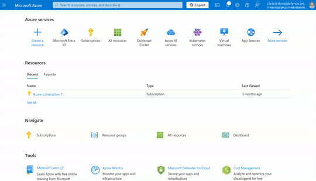
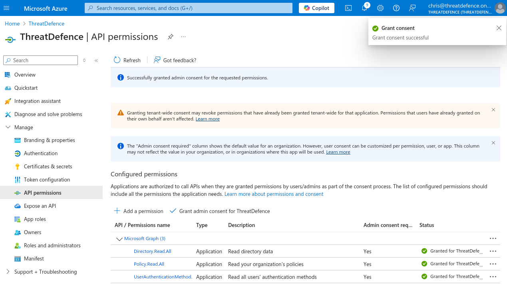

# Microsoft Azure

CybrHawk's Azure integration provides best practice assessments, audits, incident response, continuous monitoring, hardening and forensics readiness, and also offers remediations.

CybrHawk requires two types of permissions to scan Azure accounts:

* Azure Entra ID: To retrieve metadata from the identity assumed and specific Entra checks.
* Subscription scope permissions: Required to launch checks against your resources.

## Entra ID Permissions

### CybrHawk requires service principal application authentication to scan Azure accounts.

To allow CybrHawk to assume an identity to start the scan with the required privileges, privileges is necessary to create a Service Principal. To create one, follow the next steps:

1. Access to Microsoft Entra ID
2. In the left menu bar, go to "App registrations"
3. Once there, in the menu bar click on "+ New registration" to register a new application
4. Fill the "Name, select the "Supported account types" and click on "Register. You will be redirected to the applications page.
5. Once in the application page, in the left menu bar, select "Certificates & secrets"
6. In the "Certificates & secrets" view, click on "+ New client secret"
7. Fill the "Description" and "Expires" fields and click on "Add"
8. Copy the value of the secret



### Assigning the proper permissions

To allow CybrHawk to retrieve metadata from the identity assumed and specific Entra checks, it is needed to assign the following permissions:

1. Access to Microsoft Entra ID
2. In the left menu bar, go to "App registrations"
3. Once there, select the application that you have created
4. In the left menu bar, select "API permissions"
5. Then click on "+ Add a permission" and select "Microsoft Graph"
6. Once in the "Microsoft Graph" view, select "Application permissions"
7. Finally, search for "Directory", "Policy" and "UserAuthenticationMethod" select the following permissions:
   * `Directory.Read.All`
   * `Policy.Read.All`
   * `UserAuthenticationMethod.Read.All`
8. Click on "Add permissions" to apply the new permissions.
9. Finally, click on "Grant admin consent for \[your tenant]" to apply the permissions.



## Subscription Scope Permissions

The main target for performing the scans in Azure is the subscription scope. CybrHawk needs to have the proper permissions to access the subscription and retrieve the metadata needed to perform the checks.

A custom role is optional to retrieve certain data that is not covered by the Reader role. The Reader role is the minimum required to perform the scans.

### Reader Role

#### From Azure Portal

1. Access to the subscription you want to scan with CybrHawk.
2. Select "Access control (IAM)" in the left menu.
3. Click on "+ Add" and select "Add role assignment".
4. In the search bar, type `Reader`, select it and click on "Next".
5. In the Members tab, click on "+ Select members" and add the members you want to assign this role. In this case, the application made in the first part.
6. Click on "Review + assign" to apply the new role.

### Custom role

#### From Azure Portal

1. Review the custom role json below, and modify the `assignableScopes` field to be the subscription ID where the role assignment is going to be made, it should be something like `/subscriptions/XXXXXXXX-XXXX-XXXX-XXXX-XXXXXXXXXXXX`.
2. Access your subscription.
3. Select "Access control (IAM)".
4. Click on "+ Add" and select "Add custom role".
5. In the "Baseline permissions" select "Start from JSON" and upload the file downloaded and modified in the step 1.
6. Click on "Review + create" to create the new role.

```json
{
  "properties": {
    "roleName": "CybrHawkRole",
    "description": "Role used for checks that require read-only access to Azure resources and are not covered by the Reader role.",
    "assignableScopes": [
      "/{'subscriptions', 'providers/Microsoft.Management/managementGroups'}/{Your Subscription or Management Group ID}"
    ],
    "permissions": [
      {
        "actions": [
          "Microsoft.Web/sites/host/listkeys/action",
          "Microsoft.Web/sites/config/list/Action"
        ],
        "notActions": [],
        "dataActions": [],
        "notDataActions": []
      }
    ]
  }
}
```

#### Checks that require CybrHawkRole

The following checks require the CybrHawkRole permissions to be executed, if you want to receive this data, make sure you have assigned the role to the identity that is going to be assumed:

* app\_function\_access\_keys\_configured
* app\_function\_ftps\_deployment\_disabled

## Deploy the integration via the Portal

## Step 3. Deploy the integration via the Portal

Navigate to Deployment > Integrations > click add. Further guidance is available in [Managing Integrations](../../platform-management/managing-integrations.md).

Required:

* **Ensure correct Tenant name is chosen from drop-down**
* **Microsoft Graph Application ID (Client ID)**
* **Microsoft Graph Tenant ID**
* **Microsoft Secret Value**

<figure><figcaption></figcaption></figure>

## Support

If any issues, please reach out to **support@threatdefence.com** and our team will assist.
