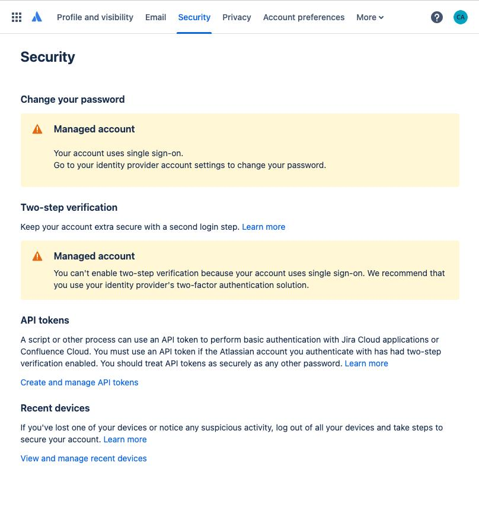
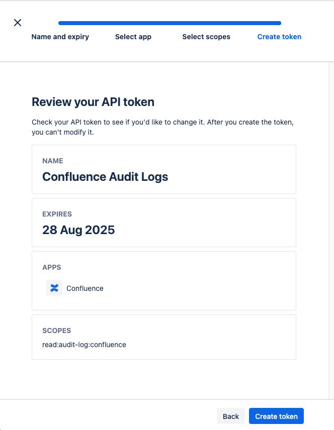

# Confluence Cloud

#### Before you begin:

* Only users with **site admin** or **organization admin** privileges can access audit logs via the Confluence Cloud API.
* This email address is required ad a deliverable.

***

#### Step 1: Generate API Token

1. **Log in to Atlassian Account**
   * Go to https://id.atlassian.com/manage-profile/security
   * Sign in with your Atlassian account credentials.
   * Note down the \***Atlassian domain** (e.g., "id.atlassian.com") 
2. **Create an API Token**
   * Locate the _**API Token**_ section.
   * Click _**Create API**_ token.
   * Enter a label (e.g., "Confluence Audit Logs").
   * Select the app _**Confluence**_
   * Select confluence scope: _**read:audit-log:confluence**_.
   *   Click _**Create**_ and then Copy the _**API token**_.

       <figure><figcaption></figcaption></figure>
3. **Get Cloud ID for Atlassian Cloud instance**
   1. **Via admin.atlassian.com**:
      * Go to admin.atlassian.com.
      * Select your organization and site.
      * The Cloud ID appears after `/s/` in the browser URL (e.g., `https://admin.atlassian.com/s/<your_cloud_id>/access-requests`)
   2. **Via API endpoint**:
      * Use the `tenant_info` endpoint:\
        `https://<your-site-name>.atlassian.net/_edge/tenant_info`\
        Replace `<your-site-name>` with your actual site name (e.g., `mycompany`).
      * This returns a JSON response:\
        `{"cloudId":"<your_cloud_id>"}`

***

#### Deliverables

Please email them to [socv2@cybrhawk.com](mailto:socv2@cybrhawk.com)

1. **Application Credentials**:
   * Please make sure the following credentials are noted in the email.
     * Atlassian domain
     * Email address
     * API Token
     * Cloud ID
