# Google Workspace

This guide walks you through enabling the **G Suite Alert Center API**, creating a **service account** and **P12 key**, delegating domain-wide access, and preparing the **deliverables** for CybrHawk.

***

## Step 1: Enable API

1. **Enable the G Suite (Admin SDK) API**
   * Open the [Google Cloud Console](https://console.cloud.google.com).
   * Go to **APIs & Services → Library**.\
     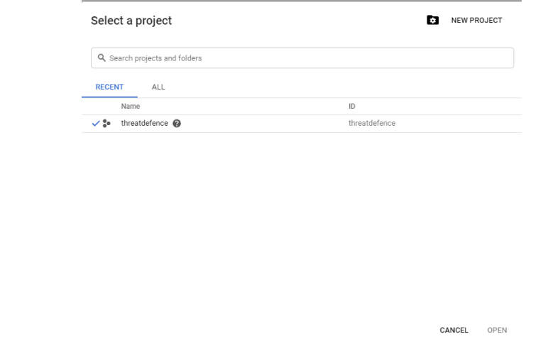
   * If no project exists, create one:
     * Click the **project dropdown** → **New Project**.
     * Provide a project **Name** and **Location**.\
       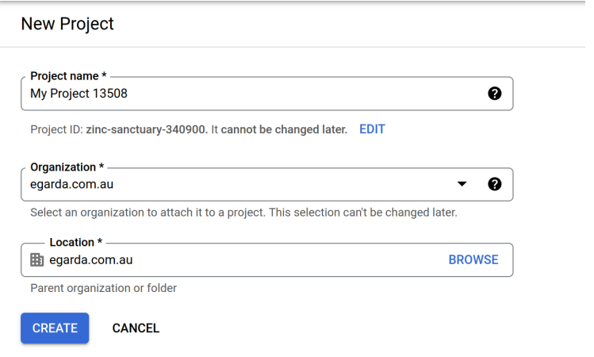
   * Select the newly created project and click **Open**.\
     &#xNAN;_&#x54;ip: wait for the project creation notification to complete before proceeding._
   * Search for **Admin SDK API** and click **Enable**.\
     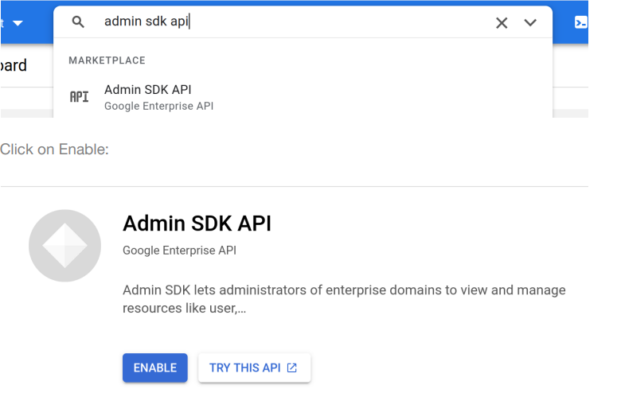

***

## Step 2: Create a Service Account

1. **Open Service Accounts**
   * Click the top-left **Menu**.
   * Navigate to **IAM & Admin → Service Accounts**.\
     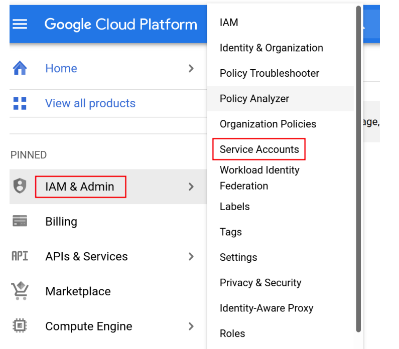
2. **Create the Service Account**
   * Click **Create Service Account** and enter a **Service account name**.\
     &#xNAN;_(Optional) Add a description._\
     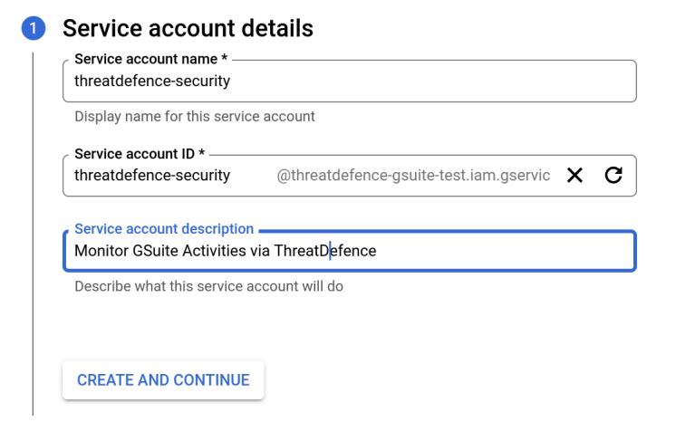
   * Click **Create**.
3. **Assign a Role**
   * Assign **Project Viewer** (or a more restrictive role suitable for your governance).
   * Click **Continue**.\
     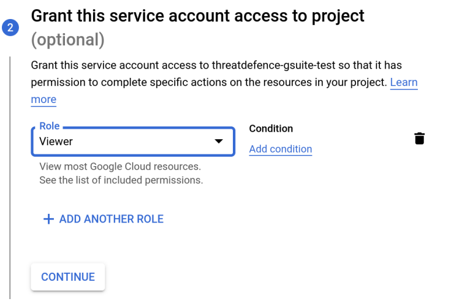
4. **Generate a P12 Key**
   * Open the service account and click **Manage Keys**.\
     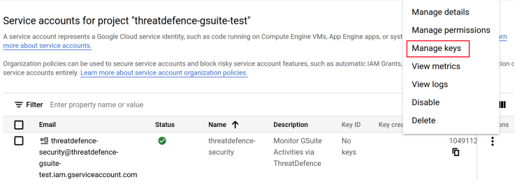
   * Click **Add Key → Create New Key**.\
     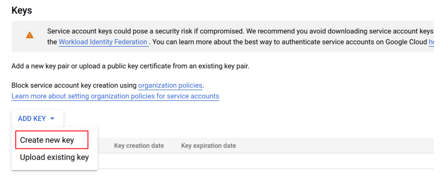
   * Choose key type **P12** and click **Create**.\
     .png>)
   * **Download** the P12 file when prompted and store it securely.
   * **Private key password:** set to `notasecret`.\
     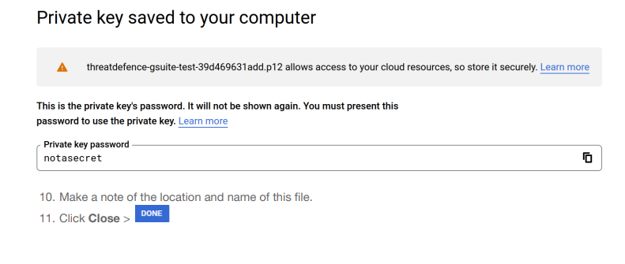
   * Record the file **path/name** for future reference, then **close**.

***

## Step 3: Add the Service Account to G Suite (Domain-Wide Delegation)

1. **Open Admin Console**
   * Go to your G Suite **Admin console**.
   * Search for **API Controls**.\
     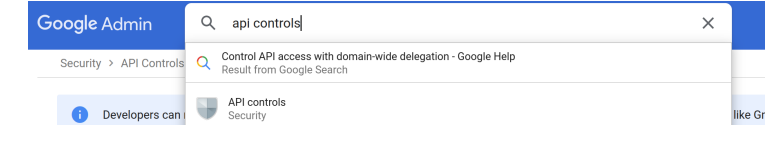
2. **Manage Domain-Wide Delegation**
   * Click **Manage Domain Wide Delegations**.\
     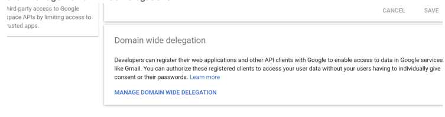
   * In **Authentication**, click **Add New**.
3. **Authorize the Client**
   * In **Client ID**, enter the **OAuth 2 Client ID** of the service account\
     (found in **IAM & Admin → Service Accounts** in Cloud Console).\
     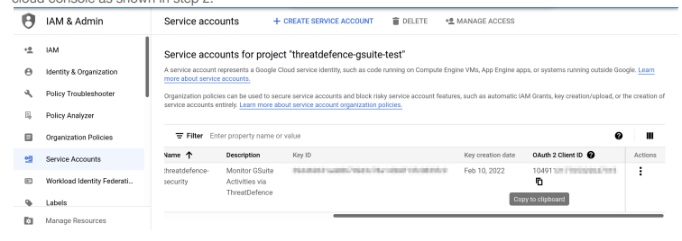
   *   In **OAuth scopes**, add:

       ```
       https://www.googleapis.com/auth/admin.reports.audit.readonly
       ```

       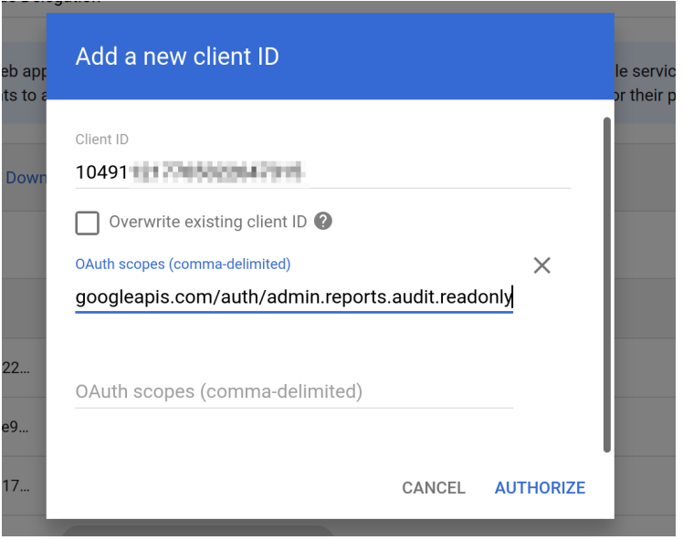
   * Click **Authorize**.

***

## Deliverables

Email the following to [**socv2@cybrhawk.com**](mailto:socv2@cybrhawk.com):

1. **P12 Key**
   * The downloaded **.p12** file (stored securely).
2. **Service Account Email Address**
   * Found under **IAM & Admin → Service Accounts** in Google Cloud Console.
3. **Administrator Email Address**
   * The admin email used when configuring domain-wide delegation.
