# Salesforce

Integrating **Salesforce** with **CybrHawk** allows you to securely ingest audit, user, and application activity into the CybrHawk platform for centralized monitoring and incident response. The following steps guide you through configuring authentication, creating an integration user, and providing the necessary API credentials.

***

## Step 1. Configure Authentication for Username–Password Flow

1. Log in to Salesforce as a **System Administrator**.
2. Navigate to the **Setup** page.
3. Open **OAuth and OpenID Connect Settings**.
4. Enable the option **Allow OAuth Username–Password Flows**.

***

## Step 2. Create a Dedicated Integration User

1. In **Setup**, search for **Users** in the Quick Find box.
2. Click **New User**.
3. Complete the user creation form with the required details (name, email, profile/role).
4. Save changes.

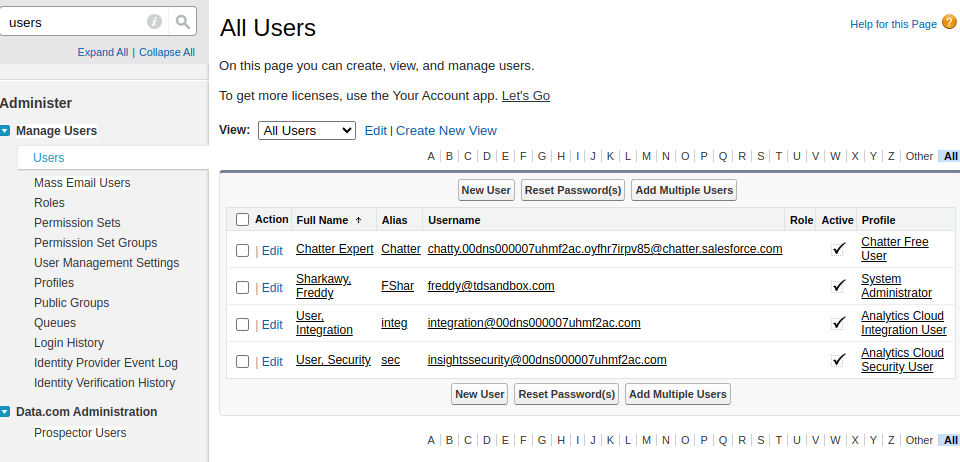

> If license limits prevent creating a new user, you may reuse an existing user with sufficient permissions.\
> Salesforce will send a password reset email to the user. Keep the username and new password securely.

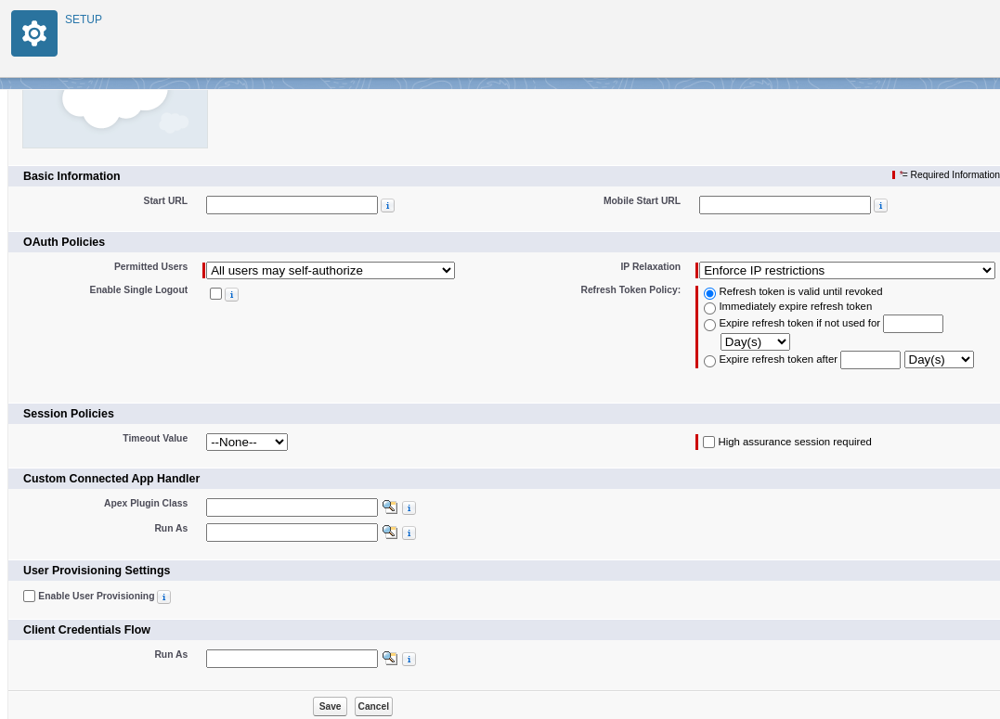

***

## Step 3. Create a New Connected App

1. In **Setup**, search for **Apps**.
2. Go to **App Manager → New Connected App** (top-right corner).

<figure>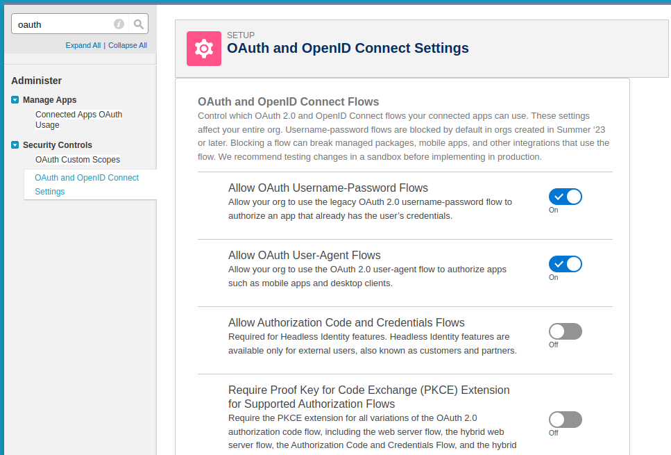<figcaption></figcaption></figure>

<figure>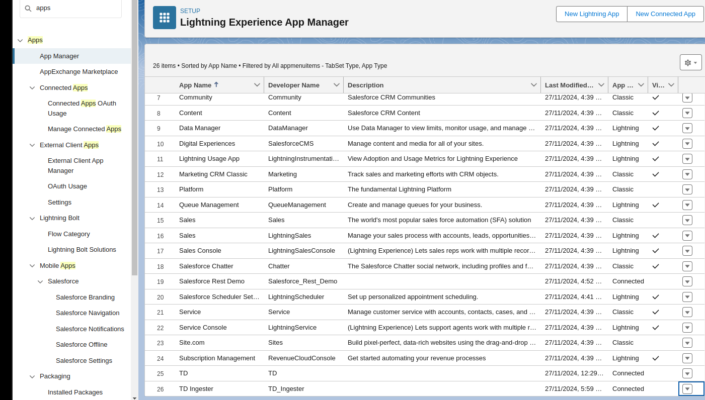<figcaption></figcaption></figure>

3. Complete the required fields (you may use any valid email).

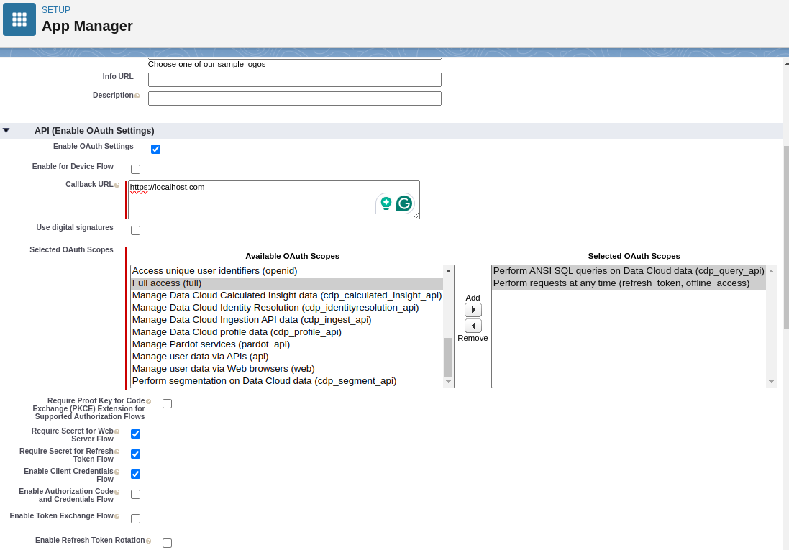

4. Enable OAuth and configure the following scopes:

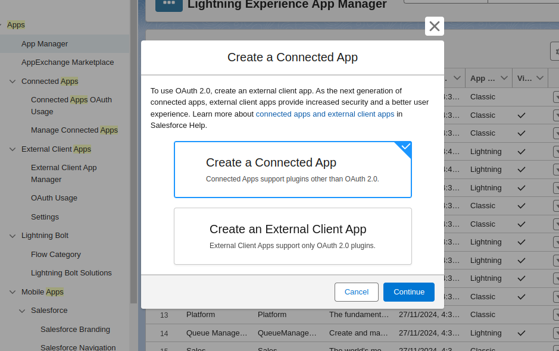

5. Save changes.

***

## Step 4. Relax IP Restrictions in OAuth Policy

1. Wait a few minutes for changes to propagate.
2. In **Setup**, search for **Apps → Connected Apps → Manage Connected Apps**.
3. Locate the Connected App you created and click its name.

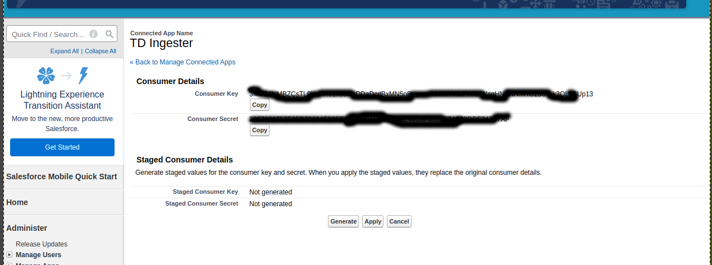

4. Select **Edit Policies**.
5. In the **OAuth Policies** section, set **Enforce IP restrictions** to **Relax IP restrictions**.
6. Save changes.

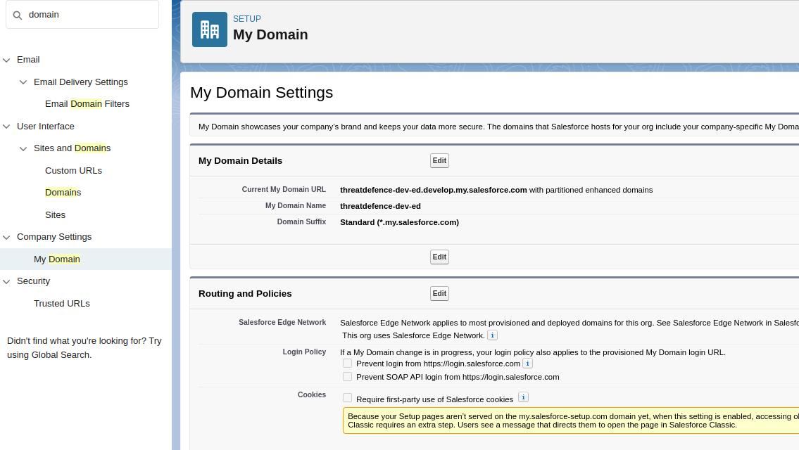

***

## Step 5. Obtain the App’s Client ID and Client Secret

1. In **Setup**, go to **Apps → App Manager**.
2. Find the Connected App you created for CybrHawk integration.
3. From the row menu (dropdown on the right), select **View**.

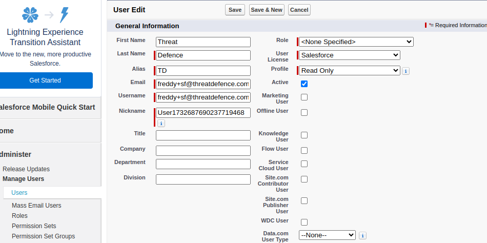

4. In the API section, click **Manage Consumer Details** (requires a verification code sent to the admin email).

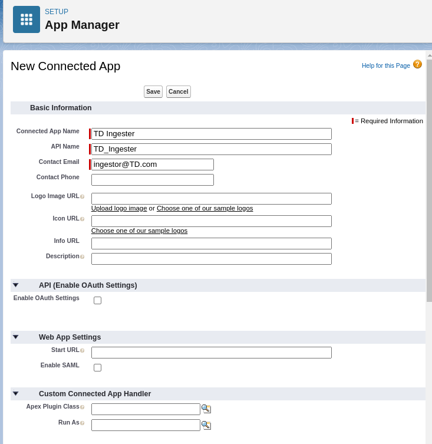

5. On the Consumer Details page, copy the following values:
   * **Consumer Key** (Client ID)
   * **Consumer Secret** (Client Secret)

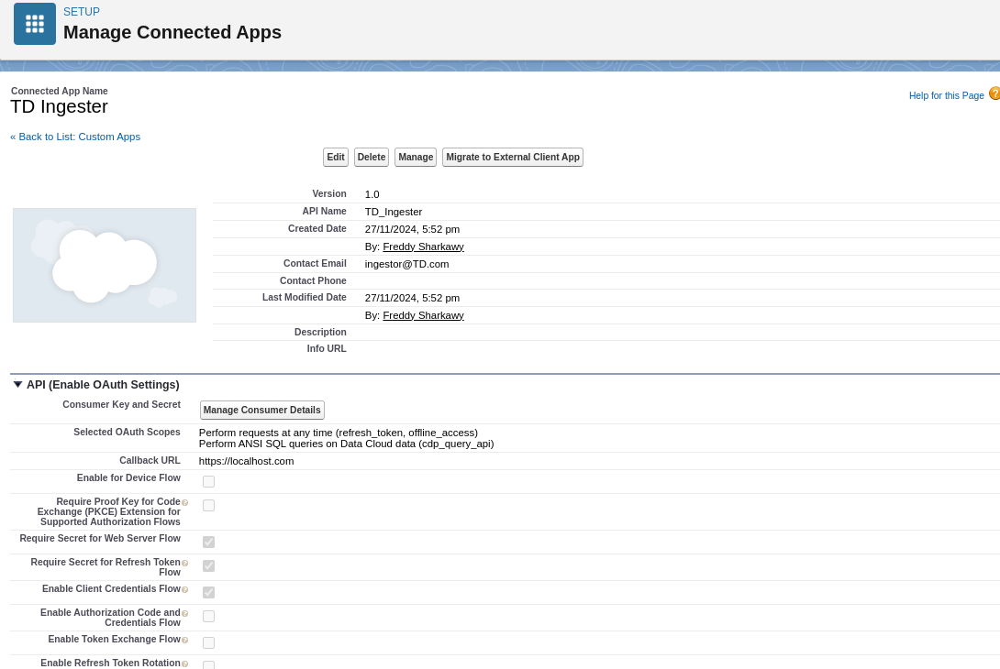

***

## Step 6. Obtain Your Salesforce Domain

1. In **Setup**, search for **Domain**.
2. Go to **Company Settings → My Domain**.
3. In the **My Domain Details** section, copy the **Current My Domain URL**.

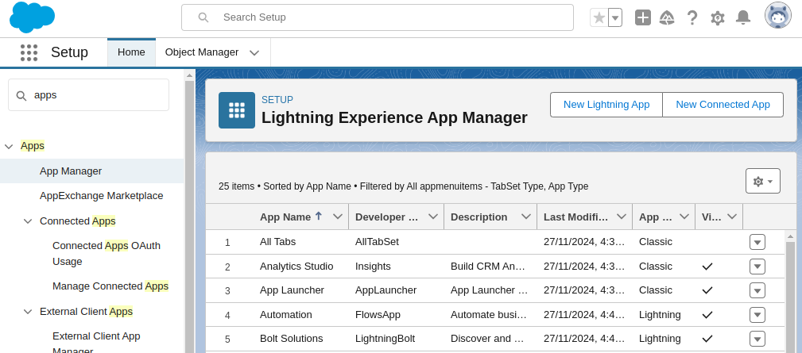

***

## Final Step. Provide Credentials to CybrHawk

Share the following values with your CybrHawk representative at [**socv2@cybrhawk.com**](mailto:socv2@cybrhawk.com):

1. **Username** — Salesforce integration user account username
2. **Password** — password for the integration user
3. **Client ID** — Consumer Key from the Connected App
4. **Client Secret** — Consumer Secret from the Connected App
5. **Domain URL** — Current My Domain URL from My Domain settings

ThreatDefence will configure ingestion using these d
