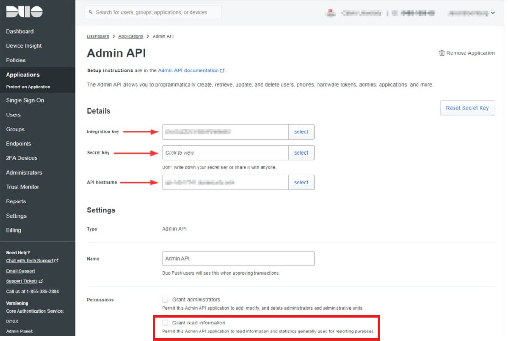

# Duo Security

Integrating **Duo Single Sign-On (SSO)** with **CybrHawk** enables secure, centralized user authentication for the platform, leveraging Duo’s strong multi-factor authentication and policy enforcement.

This integration streamlines user access while maintaining compliance and reducing identity-based risks across the organization.

***

## Step 1. Configure API Permissions

1. Navigate to **Dashboard → Applications → Admin API**.
2. To create the Admin API application: Log into the Duo Admin Panel as an administrator with the "Owner" role and navigate to Applications. Click Protect an Application and locate the entry for Admin API in the applications list. Click Protect to the far-right to configure the application and get your integration key, secret key, and API hostname. You'll need this information to update the config.yml file later. Scroll down to the "Permissions" section of the page and deselect all permission options other than Grant read log. Optionally specify which IP addresses or ranges are allowed to use this Admin API application in Networks for API Access. If you do not specify any IP addresses or ranges, this Admin API application may be accessed from any network.

Click Save. 

1. Select **Grant Read log** permission.

***

## Step 2. Configure CybrHawk Integration

Provide the following information to your CybrHawk representative at\
📧 [**CybrHawk Support**](mailto:socv2@cybrhawk.com):

* Integration Key
* Secret Key
* API Hostname

***

## Support

For questions or assistance, please contact:\
📧 [**CybrHawk Support**](mailto:socv2@cybrhawk.com)
