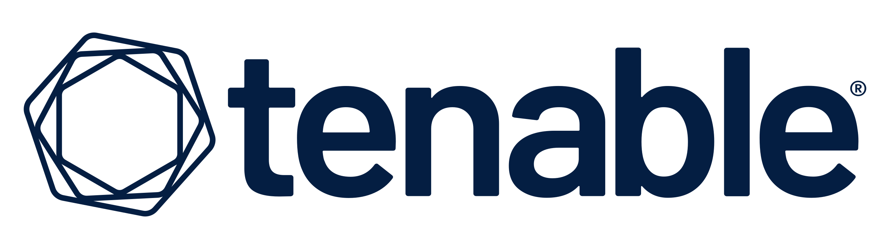

# Tenable

**Introduction**

Nessus is a popular vulnerability scanner used by numerous organizations to scan networks for security vulnerabilities and compliance issues. This guide provides instructions for integrating Tenable Security Center into the CybrHawk SIEM platform, so Nessus scan reports can be imported into the CybrHawk platform and converted into SIEM data.

The integration guide assumes a local Tenable Security Centre appliance (on premises deployment).

Tenable Security Centre provides access to resources (data entities) via REST API paths. The SIEM platform will use the REST API to make HTTP requests to retrieve scan data.

URIs for SecurityCenter's REST API resource have the following structure:

`https://host:port/rest/resource-name`

To access the API paths, the integration requires an API Access Key and Secret Key. For more information, see the Generate API section in the Tenable Security Center User Guide: https://docs.tenable.com/security-center/Content/GenerateAPIKey.htm

**Integration Steps**

To activate the integration, supply the following information to your CybrHawk representative:

* The IP address of your Tenable Security Center, or if you're a tenable cloud customer, please use this URL: https://cloud.tenable.com/vulns
* Your generated Tenable Security Center access key and secret key. For more information, see [Enable API Key Authentication](https://docs.tenable.com/security-center/Content/EnableAPIKeys.htm) and [Generate API Keys](https://docs.tenable.com/security-center/Content/GenerateAPIKey.htm).
* (Optional) Scan names to import from the Tenable Security Center.

:::tip If not set, all scans the API user has access to will be imported.
